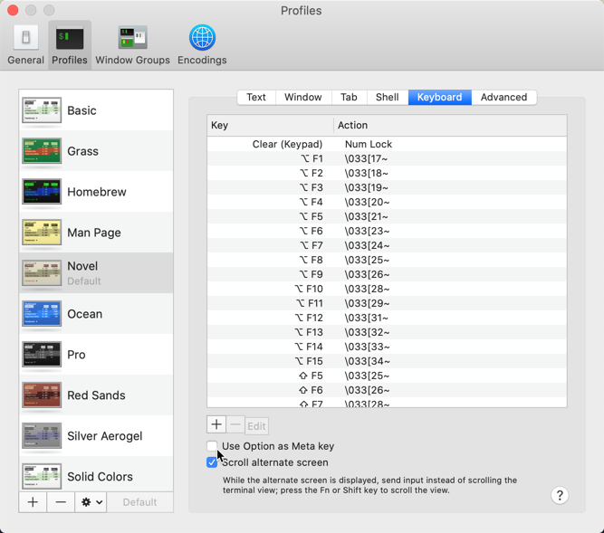

[Use Option as Meta Key in Mac OS X Terminal](http://osxdaily.com/2013/02/01/use-option-as-meta-key-in-mac-os-x-terminal/)

the meta is enabled by default in OS X Terminal, but it’s assigned to the `Escape` key

[Command key as Meta key in OS X Terminal.app](https://stackoverflow.com/questions/1856437/command-key-as-meta-key-in-os-x-terminal-app)

On my Macbook Pro (el capitan), the meta key is by default mapped to the `ESC` key.

## set Option as Meta

[EmacsForMacOS](https://www.emacswiki.org/emacs/EmacsForMacOS)

Use Alt/Option as Meta Key under terminal emulators  

Preferences -> $YourProfile -> Keyboard

- [x] Use Option as Meta key



---

在 macOS 的 iTterm2 里面，在命令行里面打开 Emacs 按 alt 不能映射到 M 上面?

[神的编辑器 Emacs](https://www.jianshu.com/p/35c2c837f3de)

Preferences -> Profiles -> $YourProfile -> Keys -> Left Option Key，默认为 `Normal`，修改为 `Esc+`。


```
You have chosen to have an option key act as Meta. 
This option is useful for backward compatibility with older systems. 
The "+Esc" option is recommended for most users. 
```

emacs 下连续按下3个 `ESC` 键，清零底栏输入。

key            | binding
---------------|--------
`ESC ESC ESC`  | keyboard-escape-quit

`C-g` : abort partially typed or executing command，Quit 清零底栏输入。