# [Sublime Text 3 插件备忘录](http://www.jianshu.com/p/9ee45b61b569)
[Sublime Text 2/3安装使用及常用插件](http://www.cnblogs.com/dudumao/p/4054086.html)  
[前端开发者需要的10个Sublime插件](http://web.jobbole.com/82177/)  
[20 个强大的 Sublime Text 插件](http://www.oschina.net/translate/20-powerful-sublimetext-plugins)  
[全栈开发必备的10款 Sublime Text 插件](http://www.cnblogs.com/lhb25/p/10-essential-sublime-text-plugins.html)  

## format & layout

### [Wrap-Plus](https://packagecontrol.io/packages/Wrap%20Plus)
[Sublime-Wrap-Plus](https://github.com/ehuss/Sublime-Wrap-Plus)

### [BracketHighlighter](https://packagecontrol.io/packages/BracketHighlighter)
[facelessuser/BracketHighlighter](https://github.com/facelessuser/BracketHighlighter)

[sublime text3下BracketHighlighter的配置方法](http://www.cnblogs.com/liu-l/p/3866458.html)

Bracket Highlighter matches a variety of brackets such as: `[]`, `()`, `{}`, `""`, `''`, `#!xml <tag></tag>`, and even custom brackets.

该插件在 gutter 列显示匹配的区块括号。

## Lines

### [Clickable Urls](https://packagecontrol.io/packages/Clickable%20URLs)
[leonid-shevtsov/ClickableUrls_SublimeText](https://github.com/leonid-shevtsov/ClickableUrls_SublimeText)

This plugin underlines URLs in Sublime Text, and lets you open them with a keystroke

1. 将鼠标放置在超链接之上，使用快捷键 `option+command+enter`(`⌥⌘↩`) / `Ctrl+Alt+Enter` 即可在默认浏览器中网址。  
2. 或双指单击右键，可以 Open %URL%。

### [Filter Lines](https://packagecontrol.io/packages/Filter%20Lines)

[davidpeckham/sublime-filterlines](https://github.com/davidpeckham/sublime-filterlines)

Quickly find all lines matching a string or regular expression

`Edit | Line` 菜单下将会增加两项：

	- **Filter with Regex**：`⌘K ⌘R`  
	- **Filter with String**：`⌘K ⌘S`  

另外，在控制面板中输入 **`Filter Lines: `** 也可列出该插件支持的可选操作。

### [Delete Blank Lines](https://packagecontrol.io/packages/DeleteBlankLines)
[NicholasBuse/sublime_DeleteBlankLines](https://github.com/NicholasBuse/sublime_DeleteBlankLines)

Deletes blank (or surplus blank) lines from a selection

[SublimeText 删除空行](http://blog.sina.com.cn/s/blog_671c54fe0102vja7.html)

`Edit | Line` 菜单下将会增加两项：

	- **Delete blank lines**：`^⌥Del`  
	- **Delete Surplus blank lines**：`⇧^⌥Del`  

另外，在控制面板中输入 **`Delet Blank Lines`** 也可列出该插件支持的可选操作。

### [Incrementor](https://packagecontrol.io/packages/Incrementor)
[Incrementor for ST2](https://github.com/eBookArchitects/Incrementor) / [Incrementor for ST3](https://github.com/born2c0de/Incrementor)  

[Increment Selection](https://packagecontrol.io/packages/Increment%20Selection)

> [How to insert a column of increasing numbers in Sublime Text 2?](https://stackoverflow.com/questions/14640093/how-to-insert-a-column-of-increasing-numbers-in-sublime-text-2)  
> [HOW TO ADD AN AUTO INCREMENTING NUMBER TO EACH SELECTION IN SUBLIME TEXT 3](http://rricketts.com/add-auto-incrementing-number-selection-sublime-text-3/)  

列选将光标置于每一行行首，然后按下 `^⌥i` 即可在每行列首插入 1234... 序号。

## File

### [HexViewer](https://packagecontrol.io/packages/HexViewer)
[HexViewer Documentation](http://facelessuser.github.io/HexViewer/)  

HexViewer is a plugin for Sublime Text that allows the toggling of a file into a hex viewing mode.   HexViewer also supports limited hex editing.

View any file (that exist on disk) in a hex format showing both byte and ASCII representation.

通过控制面板（command palette）执行 `HexViewer: Toggle Hex View` 即可开启十六进制查看模式，再次执行即可关闭。

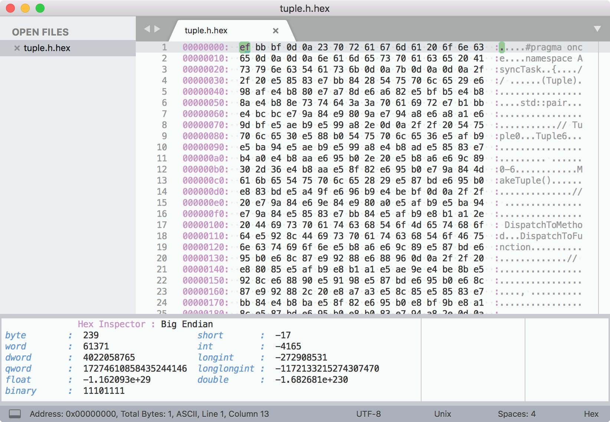

- Command to jump to a specific address

> 在十六进制模式执行 `HexViewer: Go to Offset` 即可跳转到指定偏移地址。

- In place editing of bytes or ASCII chars

> 在十六进制模式执行 `HexViewer: Show Hex Edit Panel` 即可编辑光标所在位置的字节值。

- HexViewer: Set Bytes Per Line

> 默认配置（`~/Library/Application Support/Sublime Text 3/Packages/HexViewer/hex_viewer.sublime-settings`）一行显示24个字节（"bytes_per_line" : 24）  
>> 可在 `~/Library/Application Support/Sublime Text 3/Packages/User/hex_viewer.sublime-settings` 中配置为16。  

- HexViewer: Set Bits Per Group

> 默认配置（`~/Library/Application Support/Sublime Text 3/Packages/HexViewer/hex_viewer.sublime-settings`）两个字节为一组（ "group_bytes_by_bits" : 16 ）  
>>  可在 `~/Library/Application Support/Sublime Text 3/Packages/User/hex_viewer.sublime-settings` 中配置为8。  

---

Linux/Unix（macOS）的命令行工具 od(octal dump)/hexdump 可指定（十六）进制输出：

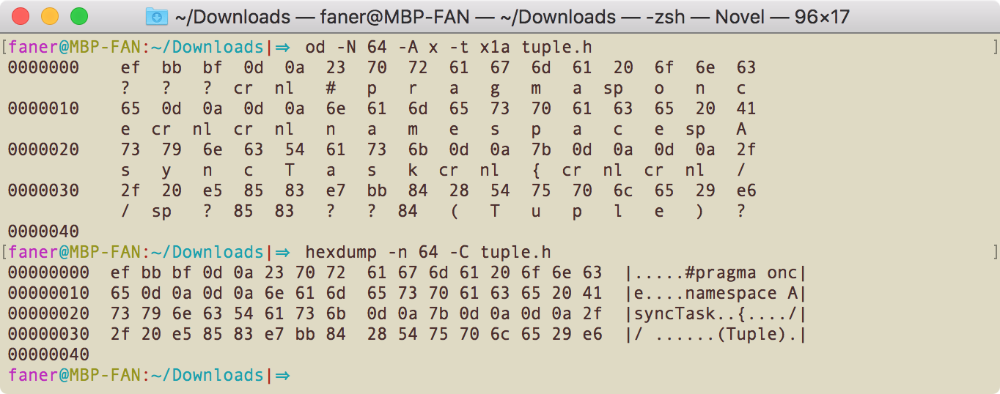

### [FileRename](https://packagecontrol.io/packages/File%20Rename)

[brianlow/FileRename](https://github.com/brianlow/FileRename)

Rename files from the ST3 command palette

**To run**:

`Ctrl-Shift-P` or `Command-Shift-P` then type **`File:Rename`** or `fr` for short.

另外一种思路：`File | Open...` 菜单支持打开文件夹，在左侧边栏中右键文件，上下文菜单支持 Rename 重命名文件。

> [Simple Way To Rename The Current File](http://www.sublimetext.com/forum/viewtopic.php?f=2&t=9534)  
> [How to rename a file in Sublime Text 3?](http://stackoverflow.com/questions/19122581/how-to-rename-a-file-in-sublime-text-3)  

### [AdvancedNewFile](https://github.com/skuroda/Sublime-AdvancedNewFile)
File creation plugin for Sublime Text 2 and Sublime Text 3.

	- `super+alt+n`(<kbd>⌘</kbd><kbd>⌥</kbd><kbd>n</kbd>): General keymap to create new files.  

底栏出现 **Enter a path for a new file**：输入 `~/Downloads/testAdvancedNewFile.txt` 然后按下 <kbd>enter</kbd> 键，即可创建并打开文件 testAdvancedNewFile.txt。

	- `shift+super+alt+n`(<kbd>⇧</kbd><kbd>⌘</kbd><kbd>⌥</kbd><kbd>n</kbd>): In addition to creating the folders specified, new folders will also contain an __init__.py file.  

这个好像快捷键和 File Navigator 的重合了？

另外，在控制面板中输入 **`ANF: `** 也可列出该插件支持的可选操作：

	- ANF: New File  
	- ANF: Delete File  
	- ANF: Rename File  
	- ANF: Copy Current File  
	- ANF: Delete Current File  

### [File Navigator](https://github.com/csch0/SublimeText-File-Navigator)
File Navigator plugin for Sublime Text

Things you can do with this plugin are:

	- **create** new files and directories
	- **copy**/**move**/**paste** existing files/directories
	- **rename** existing files
	- **delete** existing files

`super+shift+o`(<kbd>⇧</kbd><kbd>⌘</kbd><kbd>o</kbd>)：打开列表面板，展示当前所有打开文档所在的目录。

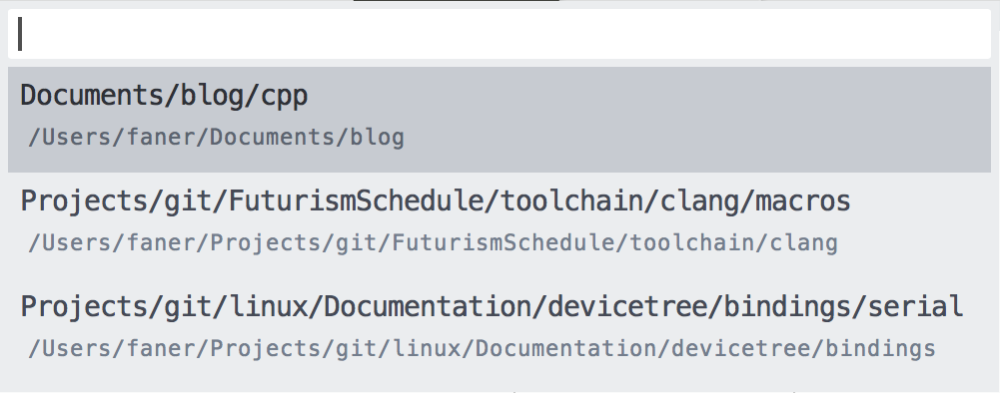

通过上下方向键移动聚焦目录，按下 <kbd>enter</kbd> 键可选中进入目录，列出目录下的文件。

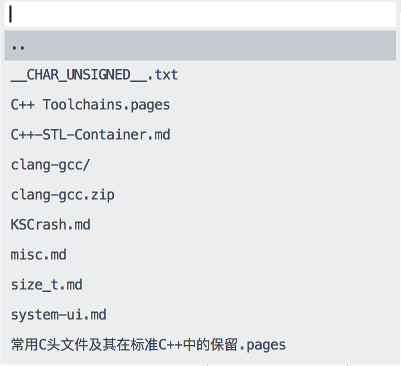

选中 `..` 按下 <kbd>enter</kbd> 键进入上层目录。  
按下  <kbd>tab</kbd>  键可在目录列表和目录操作之间切换。  

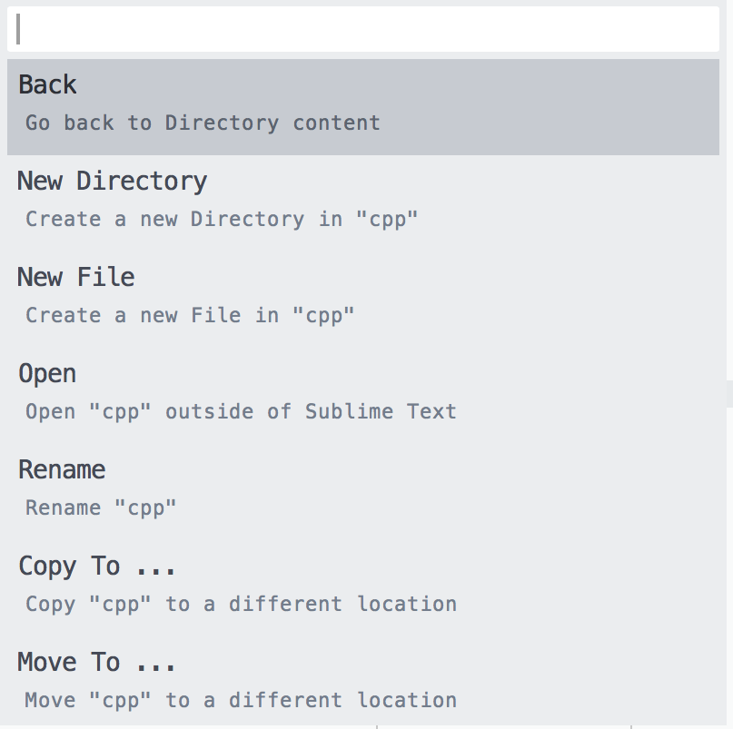

通过上下方向键移动聚焦文件，按下 <kbd>enter</kbd> 键选中文件 `C++-STL-Container.md`，然后列出可针对文件的操作项：

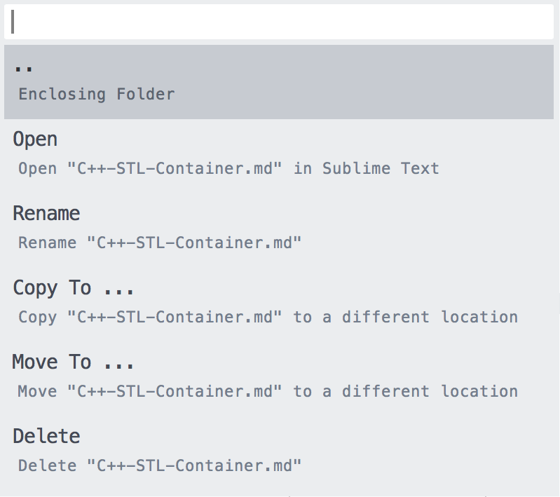

## SideBar

### [SideBarEnhancements](https://packagecontrol.io/packages/SideBarEnhancements)
[titoBouzout/SideBarEnhancements](https://github.com/titoBouzout/SideBarEnhancements)

Enhancements to Sublime Text sidebar. Files and folders.

[Sublime Text一个小插件——SideBarEnhancements](http://www.qdfuns.com/notes/13810/d9b9ed2fb80785dae88a5344ef0f30d4.html)  
[sublime text侧边栏插件-SideBarEnhancements](http://blog.csdn.net/sunny_girls/article/details/44134845)  

打开文件夹，在左侧边栏中右键文件，将出现包含 `Rename`、`Delete File`、`Reveal in Finder` 的上下文菜单：  
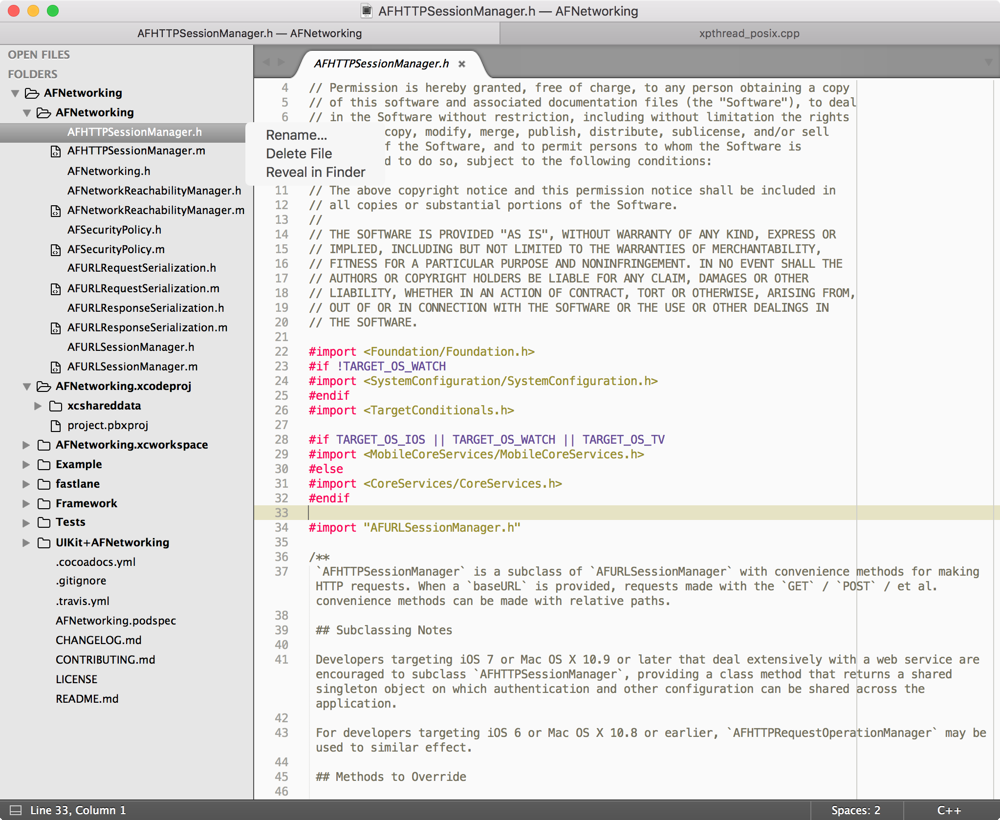

同时选中2个文件，右键上下文菜单将包含 `Diff Files ...` 菜单项：  
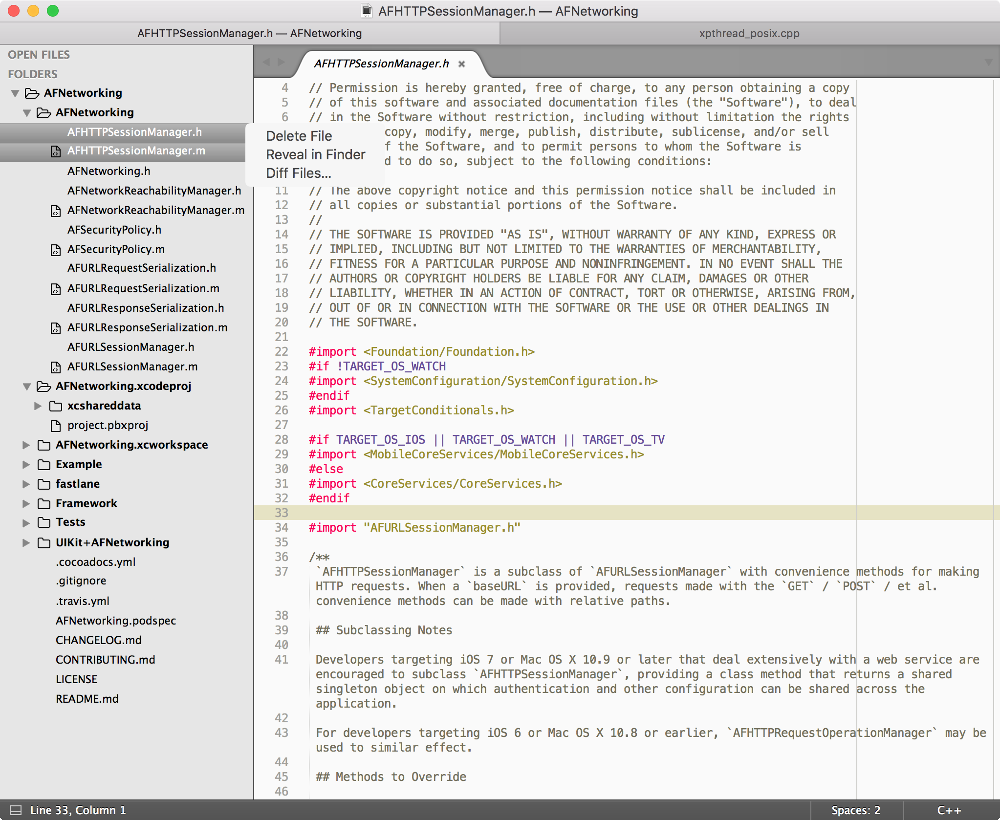

### [SyncedSideBar](https://packagecontrol.io/packages/SyncedSideBar)
[TheSpyder/SyncedSideBar](https://github.com/TheSpyder/SyncedSideBar)

plugin to sync project sidebar (**_folder view_**) with the currently active file.  
As you switch tabs Sublime **highlights** only files in folders that are already expanded.   
It accomplishes this through use of the “`reveal in side bar`” command from the default _context menu_.

安装 `SyncedSideBar` 之后，右键剪辑区出现上下文菜单中将包含 `Reveal in Side Bar` 项，点击将定位到左侧边栏中的当前文件并高亮：

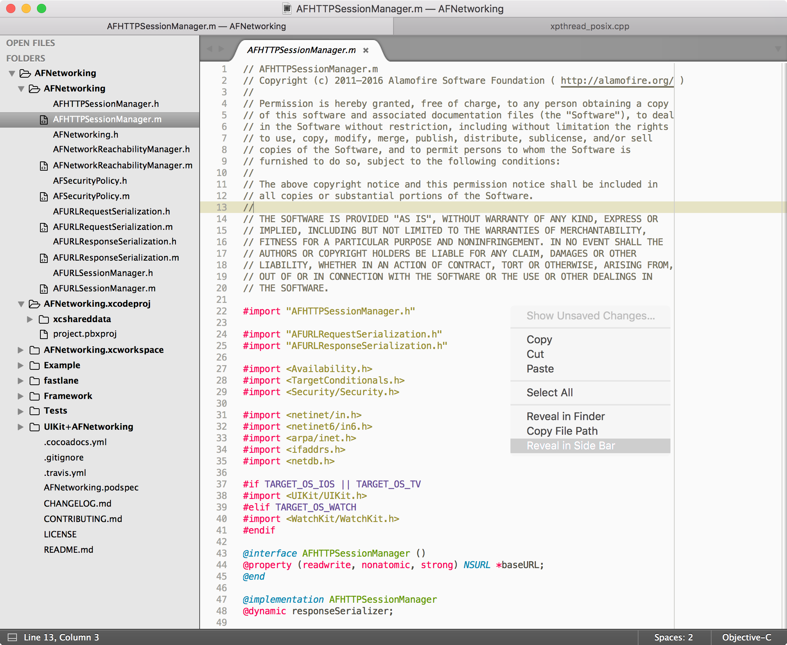

### [FileBrowser](https://packagecontrol.io/packages/FileBrowser)
[aziz/SublimeFileBrowser](https://github.com/aziz/SublimeFileBrowser)

	- **Browse Mode**: Left/Right Sidebar：左/右侧将新建一个 GROUP 展示当前文件所在目录。点击 `..` 可展开上级目录。`F1`快速打开 Left Sidebar。  
	- **Browse Mode**: Current file or project：新建一个 tab（不新建 GROUP ）。  

	- **Browse Mode**: Jump List  
	- **Browse Mode**: Jump List Quick Panel  

### [Outline](https://packagecontrol.io/packages/Outline)
shows the outline of your document or class/function name list of your code in a sidebar-style tab.  

展示 markdown 的 **TOC** 和 程序代码的**符号列表**(symbol list)。

通过 Package Control 输入 `Outline` 默认2种模式：

	- Browse Mode: Outline(Left)  
	- Browse Mode: Outline(Right)  

3种 `FileBrower` 与 `Outline` 混合模式：

	- Browse Mode:  FileBrowser Left, Outline Right  
	- Browse Mode: FileBrowser Top Left, Outline Bottom Left  
	- Browse Mode: FileBrowser Top Right, Outline Bottom Right  

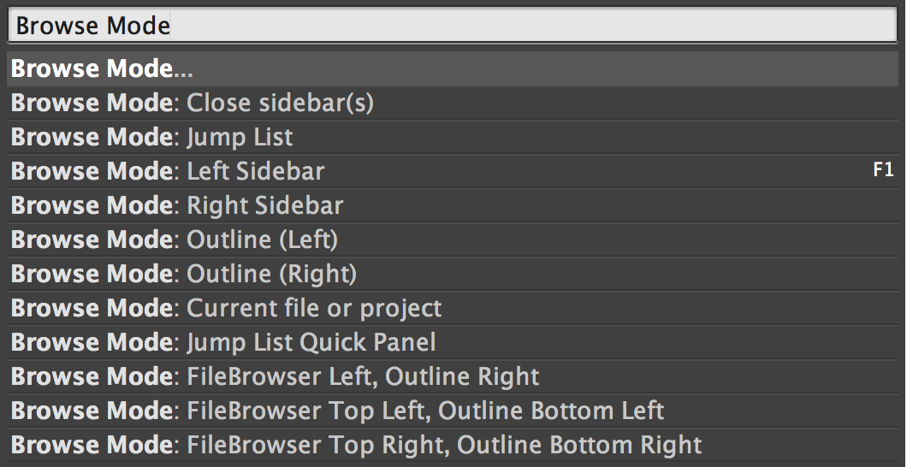

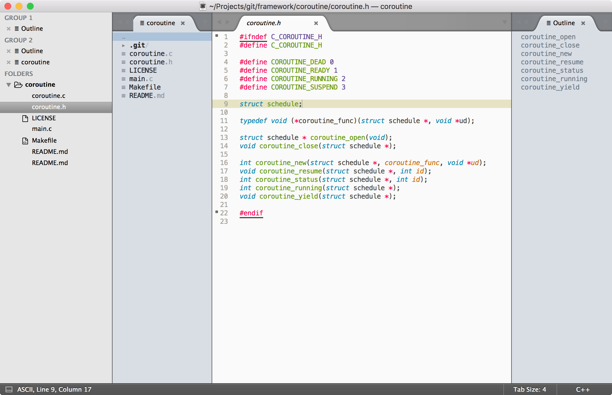

## Markdown
[Sublime插件：Markdown篇](http://www.jianshu.com/p/aa30cc25c91b)  
[在 Sublime 中配置 Markdown 环境](http://www.tuicool.com/articles/NJrQfub)  

### [Markdown Extended](https://packagecontrol.io/packages/Markdown%20Extended) + [Monokai Extended](https://packagecontrol.io/packages/Monokai%20Extended)
[Markdown Extended](https://github.com/jonschlinkert/sublime-markdown-extended) + [Monokai Extended](https://github.com/jonschlinkert/sublime-monokai-extended) 是不错的 Markdown 语法渲染及配色方案，支持对多种语言的高亮。

Monokai Extended 提供了 Origin、Bright(深色)、**_Light_**(**浅色**) 三种配色方案。  

**Switch Themes**：

Open a Markdown file in Sublime Text and make sure that syntax highlighting is set to Markdown Extended (not Markdown): `View -> Syntax -> Markdown Extended`.

Then go to `Preferences -> Color Scheme -> Monokai Extended` and pick a theme.


### [MarkdownEditing](https://packagecontrol.io/packages/MarkdownEditing)
[SublimeText-Markdown/MarkdownEditing](https://github.com/SublimeText-Markdown/MarkdownEditing)

Markdown plugin for Sublime Text. Provides a decent Markdown color scheme (light and dark) with more **robust** syntax highlighting and useful Markdown editing features for Sublime Text.

安装 **MarkdownEditing** 插件之后，`View | Syntax` 下将多出 `MarkdownEditing` 项，其下包括 _`Markdown`_、_`Markdown GFM`_、_`MultiMarkdown`_ 三种 Markdown 语法。

安装了 MarkdownEditing 插件后，打开 Markdown 文件的默认 Syntax 将变为 _**`Markdown GFM`**_。支持 Github Favored Markdown 语法高亮。

同时 **MarkdownEditing** 插件提供了 `Yellow`、`Focus`、`Dark` 三种主题配色方案。

**Key Bindings**:

OS X    | Windows/Linux | Description
--------|--------------------|------------------
⌘1...6 | Ctrl1...6                | add the corresponding number of hashmarks for headlines.
⌘Tab | ShiftTab	             | Fold/Unfold current section.
⌘⇧Tab | CtrlShiftTab | Fold all sections under headings of a certain level.

以上热键均与 SublimeText 已有热键冲突，只有 `⇧⇥` 可用于折叠段落（section）。

### [Markdown Preview](https://packagecontrol.io/packages/Markdown%20Preview)
[revolunet/sublimetext-markdown-preview](https://github.com/revolunet/sublimetext-markdown-preview)

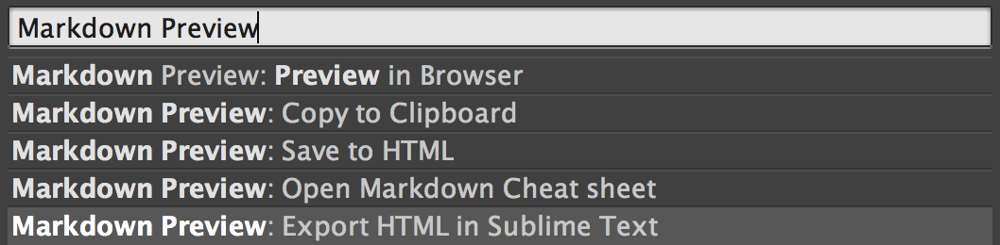

### [MarkdownLivePreview](https://packagecontrol.io/packages/MarkdownLivePreview)
A Sublime Text 3 plugin to preview your markdown as you type

<kbd>option</kbd>+<kbd>M</kbd>：新建 GROUP 在右侧(Layout = Columns:2) 展示实时渲染预览效果。

渲染效果不是很好。

### [OmniMarkupPreviewer](https://packagecontrol.io/packages/OmniMarkupPreviewer)
实时在浏览器中预览，可替代 Markdown Preview。

  **Windows, Linux:**
  
	  * <kbd>Ctrl</kbd>+<kbd>Alt</kbd>+<kbd>O</kbd>: Preview Markup in Browser.
	  * <kbd>Ctrl</kbd>+<kbd>Alt</kbd>+<kbd>X</kbd>: Export Markup as HTML.
	  * <kbd>Ctrl</kbd>+<kbd>Alt</kbd>+<kbd>C</kbd>: Copy Markup as HTML.
  
  **OSX:**
  
	  * <kbd>⌘</kbd>+<kbd>⌥</kbd>+<kbd>O</kbd>: Preview Markup in Browser.
	  * <kbd>⌘</kbd>+<kbd>⌥</kbd>+<kbd>X</kbd>: Export Markup as HTML.
	  * <kbd>Ctrl</kbd>+<kbd>Alt</kbd>+<kbd>C</kbd>: Copy Markup as HTML.

### [MarkdownTOC](https://packagecontrol.io/packages/MarkdownTOC)
MarkdownTOC(Table Of Contents) Plugin for Sublime Text

菜单 `Tools|MarkdownTOC` 下有两项：Insert TOC，Update TOC。

### Marked App Menu

[sublime-text-marked](https://github.com/icio/sublime-text-marked)

Sublime Text 2/3 - Marked App Menu plugin

安装后，通过 `Tools | Marked` 菜单或 `Command Palette: Marked` 调起 Marked(2).app 打开渲染当前 markdown 文档。

## python

### Anaconda

[Anaconda](https://packagecontrol.io/packages/Anaconda)  
[Anaconda Python IDE](http://damnwidget.github.io/anaconda/)  

Anaconda turns your Sublime Text 3 in a full featured Python development IDE including autocompletion, code linting, IDE features, autopep8 formating, McCabe complexity checker Vagrant and Docker support for Sublime Text 3 using **Jedi**, **PyFlakes**, **pep8**, **MyPy**, **PyLint**, **pep257** and **McCabe** that will never freeze your Sublime Text 3

- completion(无需再单独安装 [**Jedi**](https://packagecontrol.io/packages/Jedi%20-%20Python%20autocompletion) 插件)  
    > `"disable_anaconda_completion": false`  
- PyFlakes  
- pep8  
    > `"pep8": true`, `"anaconda_linting": true`  
- MyPy  
    > `"mypy": false`  
- PyLint  
    > `"use_pylint": false`  
- pep257 and McCabe  

Anaconda 默认开启了 **anaconda_linting**。

> `Anaconda.sublime-settings` 中 **use_pylint** 设置为 false，默认禁用 PyLint，基于 pep8 和 PyFlakes。

`Sublime > Preferences > Package Settings > Anaconda > Settings - User` 设置错误行提示风格:

```json
{
    /*
        Set to false to disable Anaconda linting entirely.
    */
    "anaconda_linting": true,

    /*

        If anaconda_gutter_marks is true, this determines what theme is used.
        Theme 'basic' only adds dots and circles to gutter.

        Other available themes are 'alpha', 'bright', 'dark', 'hard', "retina"
        (for retina displays) and 'simple'. To see icons that will be used for
        each theme check gutter_icon_themes folder in Anaconda package.
    */
    "anaconda_gutter_theme": "simple",

    /*
        If 'outline' (default), anaconda will outline error lines.
        If 'fill', anaconda will fill the lines.
        If 'solid_underline', anaconda will draw a solid underline below regions.
        If 'stippled_underline', anaconda will draw a stippled underline below regions.
        If 'squiggly_underline', anaconda will draw a squiggly underline below regions.
        If 'none', anaconda will not draw anything on error lines.
    */
    "anaconda_linter_mark_style": "stippled_underline",
}
```

#### functions

通过 Command Palette 或右键菜单 - Anaconda 可呼出以下功能：

- `Anaconda: Disable linting on this file`，选中后将不再进行 PEP8 错误标识。  

	> 选中 **Disable** 禁止 PEP8 错误提示后，将多出相应的 **Enable** 项可恢复提示。  

- `Anaconda: Show error list`：浮窗列出 PEP8 错误列表。  
- `Anaconda: Next/Previous lint error`：查看下/上 PEP8 错误。  

- `Anaconda: Autoformat PEP8 Errors`：按PEP8风格自动排版代码。

### SublimeLinter

[SublimeLinter](https://github.com/SublimeLinter) - The code linting framework for Sublime Text 3  
[SublimeLinter](https://github.com/SublimeLinter/SublimeLinter) Framework  

- [SublimeLinter-pycodestyle](https://github.com/SublimeLinter/SublimeLinter-pycodestyle)：需执行 `pip3 install pycodestyle` 安装 pycodestyle  
- [SublimeLinter-pyflakes](https://github.com/SublimeLinter/SublimeLinter-pyflakes)：需要执行 `pip3 install pyflakes` 安装 pyflakes  
- [**SublimeLinter-flake8**](https://github.com/SublimeLinter/SublimeLinter-flake8)：需要执行 `pip3 install flake8` 安装 flake8  

建议采用 SublimeLinter-flake8 插件（基于 pycodestyle,pyflakes,mccabe），无需额外安装 SublimeLinter-pycodestyle 或 SublimeLinter-pyflakes 插件。

首先，在 `Sublime > Preferences > Package Settings > Anaconda > Settings - User` 中禁用  Anaconda 的 anaconda_linting：

```json
{
    "anaconda_linting": false,
}
```

其次，按照 [Three steps to lint Python 3.6 in Sublime Text](https://janikarhunen.fi/three-steps-to-lint-python-3-6-in-sublime-text.html) 以下步骤安装 SublimeLinter-flake8 插件：

1. macOS 终端执行 `pip3 install flake8` 安装 flake8，自动检测按需安装 pyflakes, pycodestyle, mccabe 等其他依赖包；  
2. 在 Sublime Text 中 PCI（Package Control: Install Package）安装 `SublimeLinter-flake8` 插件；  

SublimeLinter-flake8 自动检测 python 代码风格和逻辑错误，Sublime Text 底部状态栏左侧会实时显示鼠标聚焦当前行的检测结果（包括 annotations 和 flake8）。

出错时对应行号左侧边列（gutter）中将会出现红点，对应代码处将以红框标出（outine）。

- warning：橙色；  
- error：红色；  

当鼠标悬浮在 gutter 或 outine 上时，将会浮出错误提示框（tooltips），显示具体的错误码和错误提示信息。

## pretty utilities

### Shell

[SublimeBashTidy](https://github.com/joysboy/SublimeBashTidy)  

[Shell​Script​Improved](https://packagecontrol.io/packages/ShellScriptImproved)  

> [Deprecated] A better ShellScript (Bash) syntax highlight for Sublime Text >= 3143

### Sublime-HTMLPrettify

[Sublime-HTMLPrettify](https://github.com/victorporof/Sublime-HTMLPrettify) 依赖 node.js  

### CSS

[**Sublime-CSS-Format**](https://github.com/mutian/Sublime-CSS-Format)  

> PCI - `CSS Format`

### [**SublimePrettyJson**](https://github.com/dzhibas/SublimePrettyJson)  

> PCI - `Pretty JSON`

[Sublime Text 3 pretty JSON](https://blog.adriaan.io/sublime-pretty-json.html)  
[Pretty JSON formatting in Sublime Text on Mac](https://sarahnothling.wordpress.com/2017/08/03/pretty-json-formatting-in-sublime-text-on-mac/)  
[Sublime Text 套件介紹（四）：Pretty JSON](https://www.camdemy.com/media/7427)  

### Ruby

> PCI - `Pretty Ruby`

### YAML

> PCI - `Pretty YAML`