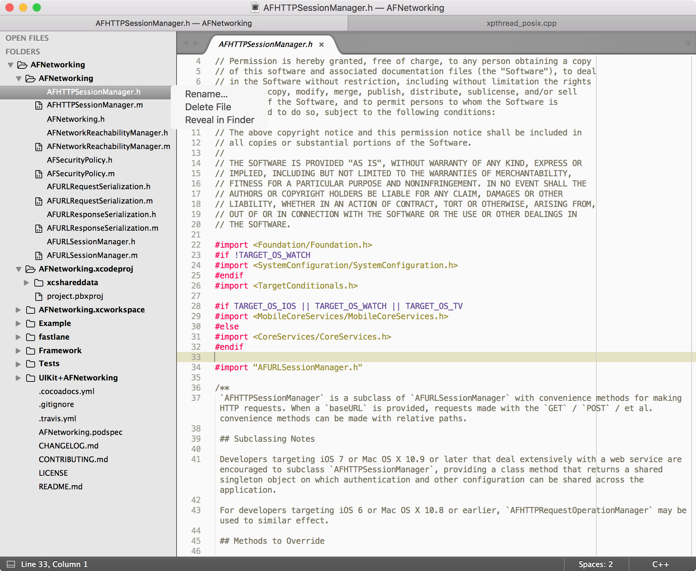

## [Package Control](https://packagecontrol.io/)
[wbond/package_control](https://github.com/wbond/package_control)

The Sublime Text package manager that makes it exceedingly simple to find, install and keep packages up-to-date.

[Sublime Text 3 安装Package Control](http://www.cnblogs.com/luoshupeng/archive/2013/09/09/3310777.html)  
[Sublime Text 3 安装插件管理 Package Control](http://jingyan.baidu.com/article/d3b74d64a302631f77e609fa.html)  
[**Sublime text 3 中Package Control 的安装与使用方法**](http://devework.com/sublime-text-3-package-control.html)  

### Simple
The simplest method of installation is through the Sublime Text console.

通过 <kbd>control</kbd><kbd>`</kbd> 可调出 ST 的控制台，在其中执行以下代码可安装 Package Control。

```python
import urllib.request,os,hashlib; h = 'df21e130d211cfc94d9b0905775a7c0f' + '1e3d39e33b79698005270310898eea76'; pf = 'Package Control.sublime-package'; ipp = sublime.installed_packages_path(); urllib.request.install_opener( urllib.request.build_opener( urllib.request.ProxyHandler()) ); by = urllib.request.urlopen( 'http://packagecontrol.io/' + pf.replace(' ', '%20')).read(); dh = hashlib.sha256(by).hexdigest(); print('Error validating download (got %s instead of %s), please try manual install' % (dh, h)) if dh != h else open(os.path.join( ipp, pf), 'wb' ).write(by)
```

### Manual
1. 从 packagecontrol.io 网站下载 [Package Control.sublime-package](https://packagecontrol.io/Package%20Control.sublime-package)。  
2. 通过菜单 `Preferences | Browse Packages` 可定位到 ST3 的插件安装目录 `~/Library/Application Support/Sublime Text 3`，回退到父目录，将下载的 **`Package Control.sublime-package`** 拷贝到 `Installed Packages` 目录。  
3. 重启 ST3，在 Preferences 菜单下将新增 Package Settings 和 Package Control 两项菜单。  


## Package Install/Remove
### Package 安装
插件的安装方法有两个：手动安装和通过插件管理器安装。
#### 手动安装
所谓手动安装，就是将下载的安装包解压缩到 Packages 目录（菜单->preferences->packages）。

**注意**：有些插件需要重命名为指定名称，请参考具体说明。

> 按下 `Command+Shift+P` / `Ctrl+Shift+P` 调出命令面板，通过 `Package Control: List Unmanaged Packages` 命令可列出手动安装不受管理器管理的插件。

#### 插件管理器安装
用 Package Control 安装插件的方法：

按下 `Command+Shift+P` / `Ctrl+Shift+P` 调出命令面板，输入 `Install` 或 `PCI` 查找到 `Package Control: Install Package`，选中点击将调出可安装的插件列表。

-PCI.png)

在搜索框中输入字符串可模糊匹配查找，例如输入 `Clickable` 搜索到 `Clickable URLs` 插件：


在列表中选中 `Clickable URLs` 插件，双击即可自动安装。  


通过插件管理器（Package Control）安装的插件存放在 `~/Library/Application Support/Sublime Text 3/Installed Packages` 目录下。


> 有的网络环境可能会不允许访问陌生的网络环境从而设置防火墙，而 Sublime Text 貌似无法设置代理，则无法获取到安装包列表了。此时，只能通过手工安装。  
>  
> 按下 `Command+Shift+P` / `Ctrl+Shift+P` 调出命令面板，通过 `Package Control: List Packages` 命令可列出所有安装的插件。  

### 插件卸载
与安装方式对应，可以直接 `Browse Packages...` 到 `Packages` 或 `Installed Packages` 目录，手工移除对应插件的目录或 `*.sublime-package` 文件。

按下 `Command+Shift+P` / `Ctrl+Shift+P` 调出命令面板，输入 `Remove` 或 `PCR`，查找到 `Package Control: Remove Package` 点击进入，选中点击某个已安装插件即可卸载。

## [Sublime Text 3 插件备忘录](http://www.jianshu.com/p/9ee45b61b569)
[Sublime Text 2/3安装使用及常用插件](http://www.cnblogs.com/dudumao/p/4054086.html)  
[前端开发者需要的10个Sublime插件](http://web.jobbole.com/82177/)  
[20 个强大的 Sublime Text 插件](http://www.oschina.net/translate/20-powerful-sublimetext-plugins)  
[全栈开发必备的10款 Sublime Text 插件](http://www.cnblogs.com/lhb25/p/10-essential-sublime-text-plugins.html)  

### [Clickable Urls](https://packagecontrol.io/packages/Clickable%20URLs)
[leonid-shevtsov/ClickableUrls_SublimeText](https://github.com/leonid-shevtsov/ClickableUrls_SublimeText)

This plugin underlines URLs in Sublime Text, and lets you open them with a keystroke

1. 将鼠标放置在超链接之上，使用快捷键 `option+command+enter`(`⌥⌘↩`) / `Ctrl+Alt+Enter` 即可在默认浏览器中网址。  
2. 或双指单击右键，可以 Open %URL%。

### [FileRename](https://packagecontrol.io/packages/File%20Rename)
[brianlow/FileRename](https://github.com/brianlow/FileRename)

Rename files from the ST3 command palette

**To run**:

`Ctrl-Shift-P` or `Command-Shift-P` then type `File:Rename` or `fr` for short.

### [Filter Lines](https://packagecontrol.io/packages/Filter%20Lines)
[davidpeckham/sublime-filterlines](https://github.com/davidpeckham/sublime-filterlines)

Quickly find all lines matching a string or regular expression

`Edit | Line` 菜单下将会增加两项：

- **Filter with Regex**：`⌘K ⌘R`  
- **Filter with Regexg**：`⌘K ⌘S`  

### [Delete Blank Lines](https://packagecontrol.io/packages/DeleteBlankLines)
[NicholasBuse/sublime_DeleteBlankLines](https://github.com/NicholasBuse/sublime_DeleteBlankLines)

Deletes blank (or surplus blank) lines from a selection

[SublimeText 删除空行](http://blog.sina.com.cn/s/blog_671c54fe0102vja7.html)

`Edit | Line` 菜单下将会增加两项：

- **Delete blank lines**：`^⌥Del`  
- **Delete Surplus blank lines**：`⇧^⌥Del`  

### [Wrap-Plus](https://packagecontrol.io/packages/Wrap%20Plus)
[Sublime-Wrap-Plus](https://github.com/ehuss/Sublime-Wrap-Plus)

### [BracketHighlighter](https://packagecontrol.io/packages/BracketHighlighter)
[facelessuser/BracketHighlighter](https://github.com/facelessuser/BracketHighlighter)

[sublime text3下BracketHighlighter的配置方法](http://www.cnblogs.com/liu-l/p/3866458.html)

Bracket Highlighter matches a variety of brackets such as: `[]`, `()`, `{}`, `""`, `''`, `#!xml <tag></tag>`, and even custom brackets.

### SideBar
#### [SideBarEnhancements](https://packagecontrol.io/packages/SideBarEnhancements)
[titoBouzout/SideBarEnhancements](https://github.com/titoBouzout/SideBarEnhancements)

Enhancements to Sublime Text sidebar. Files and folders.

[Sublime Text一个小插件——SideBarEnhancements](http://www.qdfuns.com/notes/13810/d9b9ed2fb80785dae88a5344ef0f30d4.html)  
[sublime text侧边栏插件-SideBarEnhancements](http://blog.csdn.net/sunny_girls/article/details/44134845)

打开文件夹，在左侧边栏中右键文件，将出现包含 `Rename`、`Delete File`、`Reveal in Finder` 的上下文菜单：  


同时选中2个文件，右键上下文菜单将包含 `Diff Files ...` 菜单项：  


#### [SyncedSideBar](https://packagecontrol.io/packages/SyncedSideBar)
[TheSpyder/SyncedSideBar](https://github.com/TheSpyder/SyncedSideBar)

plugin to sync project sidebar (**_folder view_**) with the currently active file.  
As you switch tabs Sublime **highlights** only files in folders that are already expanded.   
It accomplishes this through use of the “`reveal in side bar`” command from the default _context menu_.

安装 `SyncedSideBar` 之后，右键剪辑区出现上下文菜单中将包含 `Reveal in Side Bar` 项，点击将定位到左侧边栏中的当前文件并高亮：


#### [FileBrowser](https://packagecontrol.io/packages/FileBrowser)
[aziz/SublimeFileBrowser](https://github.com/aziz/SublimeFileBrowser)

- **Browse Mode**: Left/Right Sidebar：左/右侧将新建一个 GROUP 展示当前文件所在目录。点击 `..` 可展开上级目录。`F1`快速打开 Left Sidebar。  
- **Browse Mode**: Current file or project：新建一个 tab（不新建 GROUP ）。  

- **Browse Mode**: Jump List  
- **Browse Mode**: Jump List Quick Panel  

#### [Outline](https://packagecontrol.io/packages/Outline)
shows the outline of your document or class/function name list of your code in a sidebar-style tab.  

展示 markdown 的 **TOC** 和 程序代码的**符号列表**(symbol list)。

通过 Package Control 输入 `Outline` 默认2种模式：

- Browse Mode: Outline(Left)  
- Browse Mode: Outline(Right)  

3种 `FileBrower` 与 `Outline` 混合模式：

- Browse Mode:  FileBrowser Left, Outline Right  
- Browse Mode: FileBrowser Top Left, Outline Bottom Left  
- Browse Mode: FileBrowser Top Right, Outline Bottom Right  


### Markdown
[Sublime插件：Markdown篇](http://www.jianshu.com/p/aa30cc25c91b)  
[在 Sublime 中配置 Markdown 环境](http://www.tuicool.com/articles/NJrQfub)  

#### [Markdown Extended](https://packagecontrol.io/packages/Markdown%20Extended) + [Monokai Extended](https://packagecontrol.io/packages/Monokai%20Extended)
[Markdown Extended](https://github.com/jonschlinkert/sublime-markdown-extended) + [Monokai Extended](https://github.com/jonschlinkert/sublime-monokai-extended) 是不错的 Markdown 语法渲染及配色方案，支持对多种语言的高亮。

Monokai Extended 提供了 Origin、Bright(深色)、**_Light_**(**浅色**) 三种配色方案。  

**Switch Themes**：

Open a Markdown file in Sublime Text and make sure that syntax highlighting is set to Markdown Extended (not Markdown): `View -> Syntax -> Markdown Extended`.

Then go to `Preferences -> Color Scheme -> Monokai Extended` and pick a theme.


#### [MarkdownEditing](https://packagecontrol.io/packages/MarkdownEditing)
[SublimeText-Markdown/MarkdownEditing](https://github.com/SublimeText-Markdown/MarkdownEditing)

Markdown plugin for Sublime Text. Provides a decent Markdown color scheme (light and dark) with more **robust** syntax highlighting and useful Markdown editing features for Sublime Text.

安装 **MarkdownEditing** 插件之后，`View | Syntax` 下将多出 `MarkdownEditing` 项，其下包括 _`Markdown`_、_`Markdown GFM`_、_`MultiMarkdown`_ 三种 Markdown 语法。

安装了 MarkdownEditing 插件后，打开 Markdown 文件的默认 Syntax 将变为 _**`Markdown GFM`**_。支持 Github Favored Markdown 语法高亮。

同时 **MarkdownEditing** 插件提供了 `Yellow`、`Focus`、`Dark` 三种主题配色方案。

**Key Bindings**:

OS X    | Windows/Linux | Description
--------|--------------------|------------------
⌘1...6 | Ctrl1...6                | add the corresponding number of hashmarks for headlines.
⌘Tab | ShiftTab	             | Fold/Unfold current section.
⌘⇧Tab | CtrlShiftTab | Fold all sections under headings of a certain level.

以上热键均与 SublimeText 已有热键冲突，只有 `⇧⇥` 可用于折叠段落（section）。

#### [Markdown Preview](https://packagecontrol.io/packages/Markdown%20Preview)
[revolunet/sublimetext-markdown-preview](https://github.com/revolunet/sublimetext-markdown-preview)


#### [MarkdownLivePreview](https://packagecontrol.io/packages/MarkdownLivePreview)
A Sublime Text 3 plugin to preview your markdown as you type

<kbd>option</kbd>+<kbd>M</kbd>：新建 GROUP 在右侧(Layout = Columns:2) 展示实时渲染预览效果。

渲染效果不是很好。

#### [OmniMarkupPreviewer](https://packagecontrol.io/packages/OmniMarkupPreviewer)
实时在浏览器中预览，可替代 Markdown Preview。

  **Windows, Linux:**
  
  * <kbd>Ctrl</kbd>+<kbd>Alt</kbd>+<kbd>O</kbd>: Preview Markup in Browser.
  * <kbd>Ctrl</kbd>+<kbd>Alt</kbd>+<kbd>X</kbd>: Export Markup as HTML.
  * <kbd>Ctrl</kbd>+<kbd>Alt</kbd>+<kbd>C</kbd>: Copy Markup as HTML.
  
  **OSX:**
  
  * <kbd>⌘</kbd>+<kbd>⌥</kbd>+<kbd>O</kbd>: Preview Markup in Browser.
  * <kbd>⌘</kbd>+<kbd>⌥</kbd>+<kbd>X</kbd>: Export Markup as HTML.
  * <kbd>Ctrl</kbd>+<kbd>Alt</kbd>+<kbd>C</kbd>: Copy Markup as HTML.

#### [MarkdownTOC](https://packagecontrol.io/packages/MarkdownTOC)
MarkdownTOC(Table Of Contents) Plugin for Sublime Text

菜单 `Tools|MarkdownTOC` 下有两项：Insert TOC，Update TOC。
