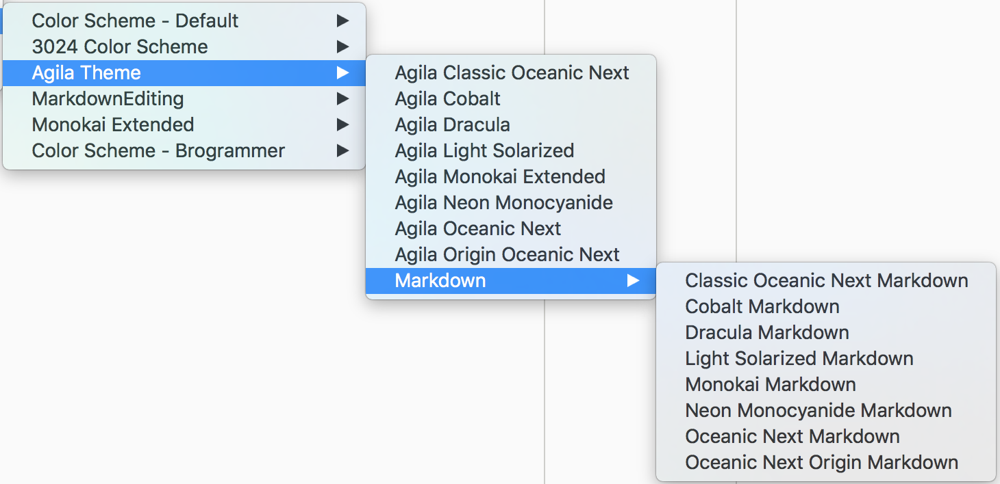

## Theme
通过菜单 `Preferences -> Theme`，或者 `Command+Shift+P` 呼起命令面板输入 `UI: Select Theme` 即可调出主题选择列表。

默认主题为：**`Default.sublime-theme`**

在 `~/Library/Application Support/Sublime Text 3/Cache` 目录下与 theme 相关的内容如下：

```Shell
faner@THOMASFAN-MB0:~/Library/Application Support/Sublime Text 3/Cache|
⇒  ls | grep '[tT]heme'       
Agila Theme
Ciapre.tmTheme
Theme - Default
Theme - Seti Monokai
dracula-theme-master
```

## Color Scheme
通过菜单 `Preferences -> Color Scheme`，或者 `Command+Shift+P` 呼起命令面板输入 `UI: Select Color Scheme` 即可调出颜色主题选择列表。

### Color Scheme - Default
```Shell
➜  Color Scheme - Default  pwd
/Users/faner/Library/Application Support/Sublime Text 3/Cache/Color Scheme - Default
➜  Color Scheme - Default  tree -L 1
.
├── All\ Hallow's\ Eve.tmTheme.cache
├── Amy.tmTheme.cache
├── Blackboard.tmTheme.cache
├── Breakers.tmTheme.cache
├── Cobalt.tmTheme.cache
├── Dawn.tmTheme.cache
├── Eiffel.tmTheme.cache
├── Espresso\ Libre.tmTheme.cache
├── IDLE.tmTheme.cache
├── iPlastic.tmTheme.cache
├── LAZY.tmTheme.cache
├── Mac\ Classic.tmTheme.cache
├── MagicWB\ (Amiga).tmTheme.cache
├── Mariana.tmTheme.cache
├── Monokai\ Bright.tmTheme.cache
├── Monokai.tmTheme.cache
├── Pastels\ on\ Dark.tmTheme.cache
├── Slush\ &\ Poppies.tmTheme.cache
├── Solarized\ (Dark).tmTheme.cache
├── Solarized\ (Light).tmTheme.cache
├── SpaceCadet.tmTheme.cache
├── Sunburst.tmTheme.cache
├── Twilight.tmTheme.cache
└── Zenburnesque.tmTheme.cache

0 directories, 24 files
➜  Color Scheme - Default  
```

tmTheme            | color
-------------------|---------------------
All Hallow's Eve | ⭐️⭐️⭐️对比度强
Cobalt                   | ⭐️⭐️⭐️️⭐️️暗蓝底色，对比度强，推荐
Dawn                    | ⭐️⭐️普通白色
Eiffel                     | ⭐⭐️⭐️白色，推荐
iPlastic                 | ⭐⭐️⭐️灰白背景，推荐
Mac Classic        | ⭐⭐️⭐️白色背景，推荐
Monokai Bright     | ⭐⭐️⭐️黑色背景，推荐
Monokai                  | ⭐⭐️黑色背景，一般
**Slush & Poppies**  | ⭐⭐️⭐️⭐️灰白背景，简洁推荐
Solarized (Dark)   | ⭐️⭐️⭐️️经典，推荐
Solarized (Light)  | ⭐️⭐️⭐️️⭐️️经典，推荐
Sunburst                | ⭐️⭐️⭐️️黑色背景，推荐
Twilight                  | ⭐⭐️黑色背景，对比一般
Zenburnesque      | ⭐⭐️⭐️深灰背景，推荐

### 安装第三方主题
通过菜单 `Preferences -> Browse Packages` 可进入 Finder 的  `~/Library/Application Support/Sublime Text 3/Packages` 目录。

#### [Brogrammer](https://packagecontrol.io/packages/Theme%20-%20Brogrammer)
[kenwheeler/brogrammer-theme](https://github.com/kenwheeler/brogrammer-theme)

Brogrammer is a flat sexy Sublime Text theme. Pushups not included.

经典暗黑深色主题。

#### [3024 Color Scheme](https://packagecontrol.io/packages/3024%20Color%20Scheme)
- day  
- **night**  

#### [Monokai Extended](https://packagecontrol.io/packages/Monokai%20Extended)
-  Origin  
- **_Light_**(**浅色**)  
- Bright(深色)  

#### [Agila Theme](https://packagecontrol.io/packages/Agila%20Theme)


#### 其他
- [ayu](https://packagecontrol.io/packages/ayu)  
- [Theme - Soda](https://packagecontrol.io/packages/Theme%20-%20Soda)  
- [Soda Solarized​Dark](https://packagecontrol.io/packages/Theme%20-%20Soda%20SolarizedDark)  
- [Ciapre Color Scheme](https://packagecontrol.io/packages/Ciapre%20Color%20Scheme)  
- [Dracula Color Scheme](https://packagecontrol.io/packages/Dracula%20Color%20Scheme)  

### Sublime Text 3 3143
淡色主题：

- 3024 Day  
- *Monokai Extended  Light*  

暗黑主题：

- Mariana(灰蒙)  
- Agila Cobalt(清灰)  
- Agila Monokai Extended(轻灰)  
- 3024 Night(暗黑)  
- Brogrammer(暗黑)  
- Agila Neon Monocyanide(暗黑)  

## Settings
通过菜单或快捷键 `⌘,` 打开设置项进行编辑。

- 左侧为 `Preferences.sublime-settings - Default`；
- 右侧为 `Preferences.sublime-settings - User`。

默认使用左侧的默认设置，如有需要可复制左侧的键值(key-value)到右侧，编辑对应配置项的值(value)。

也即 User 覆盖 Default，如果 User 中没有配置，则使用 Default 中的默认配置。

### translate_tabs_to_spaces
[将Tab键自动替换为4个空格](http://blog.csdn.net/intel80586/article/details/8306699)

Preferences->Settings User新增以下 KV：

---

```YAML
// Set to true to insert spaces when tab is pressed
“translate_tabs_to_spaces”: true,
```

### open_files_in_new_window
禁用新窗口打开，所有文件在一个窗口中以多 tab 模式打开。

Preferences->Settings User新增以下 KV：

---

```YAML
"open_files_in_new_window": false
```

**注意：**

> 多个 KV 行末用逗号分隔！

