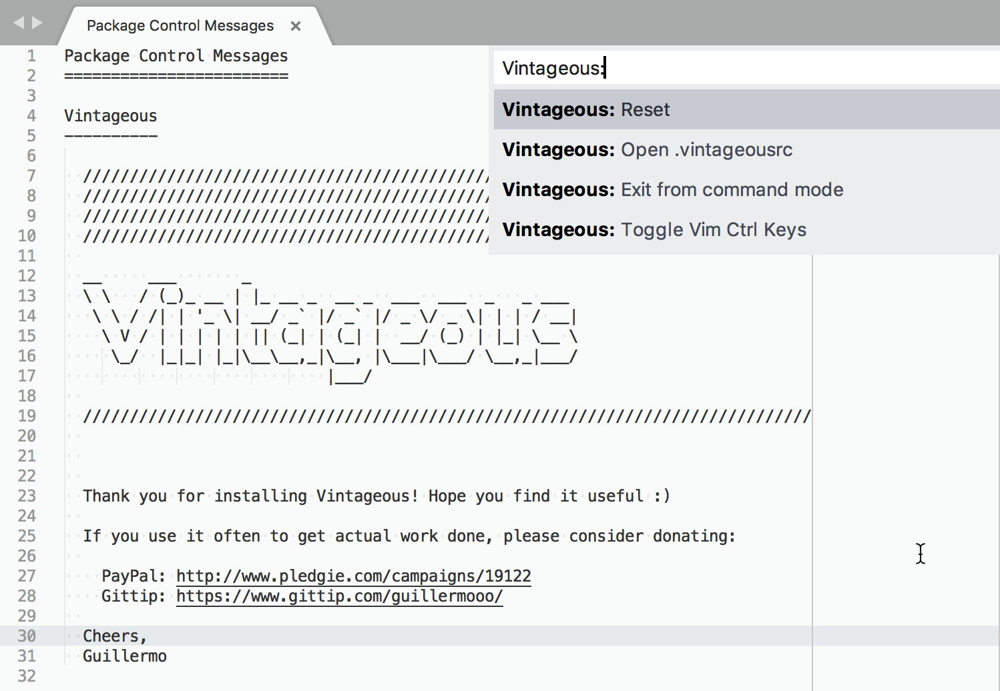

[Vintage](https://github.com/sublimehq/Vintage) mode adds a vi style command mode to Sublime Text 2  
[VintageEx](https://github.com/SublimeText/VintageEx) - An implementation of Vim's command-line mode for Sublime Text 2  

# vi/Vim Emulation

This information is useful for Vim users who are now using Sublime Text.

vi is an ancient modal editor that lets the user perform all operations from the keyboard. Vim, a modern version of vi, is still in widespread use.

Sublime Text provides vi emulation through the Vintage package. The Vintage package is ignored by default. Learn more about [Vintage](http://www.sublimetext.com/docs/3/vintage.html) in the official documentation.

> 通过菜单 `Preferences | Settings`，或通过快捷键 <kbd>⌘</kbd><kbd>,</kbd>，或在命令面板中输入  `Preferences: Settings` 可打开查看 Preferences.sublime-settings — User，可知 Vintage 默认在 ignored_packages 中，已经被忽略（禁用），启动时不会加载。

An evolution of Vintage, called [Vintageous](http://guillermooo.bitbucket.org/Vintageous), offers a better vi/Vim editing experience and is updated more often than Vintage. [Vintageous](http://guillermooo.bitbucket.org/Vintageous) is an open source project.

> 按下 `Ctrl+Shift+P` / `Command+Shift+P`（<kbd>⌘</kbd><kbd>⇧</kbd><kbd>p</kbd>）调出**命令面板**（[Command Palette](http://docs.sublimetext.info/en/sublime-text-3/reference/command_palette.html)），输入 `Vintageous: ` 可查看 Vintageous 的命令。

- Toggle Vim Ctrl Keys：开启 Vim 命令模式；  
- Exit from command mode：退出 Vim 命令模式。  
