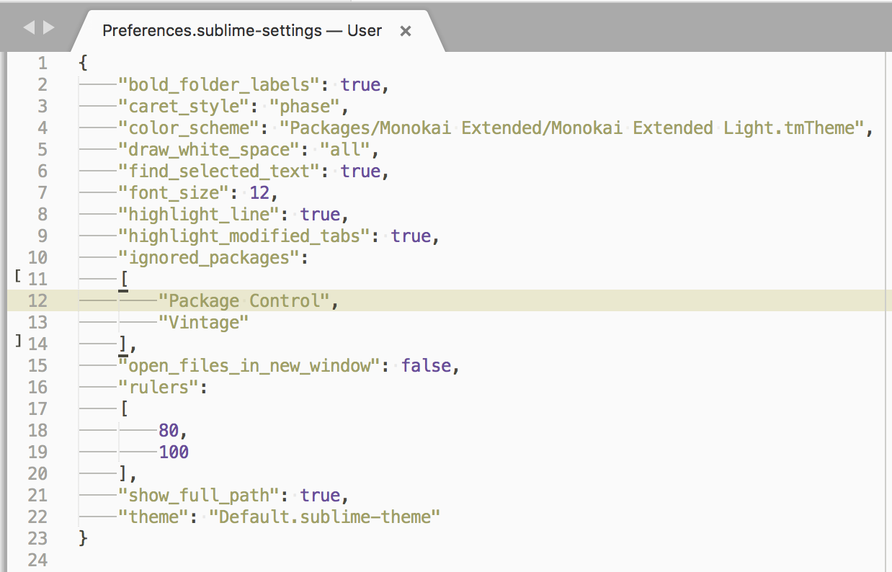
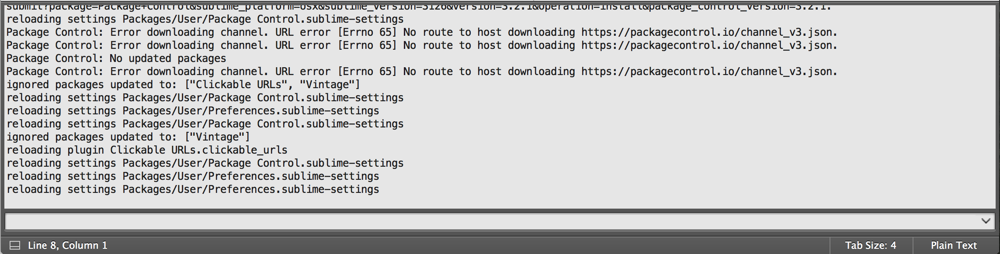

# [Package Control](https://packagecontrol.io/)
[wbond/package_control](https://github.com/wbond/package_control)

The Sublime Text package manager that makes it exceedingly simple to find, install and keep packages up-to-date.

[Sublime Text 3 安装Package Control](http://www.cnblogs.com/luoshupeng/archive/2013/09/09/3310777.html)  
[Sublime Text 3 安装插件管理 Package Control](http://jingyan.baidu.com/article/d3b74d64a302631f77e609fa.html)  
[**Sublime text 3 中Package Control 的安装与使用方法**](http://devework.com/sublime-text-3-package-control.html)  
[10 Essential Sublime Text Plugins for Full-Stack Developers](https://www.sitepoint.com/10-essential-sublime-text-plugins-full-stack-developer/)  

[解决sublime text3安装Package Control问题](http://blog.csdn.net/zr15829039341/article/details/73136319)  
[Sublime Text 3安装Package Control插件](http://www.jianshu.com/p/7465afd9857f)  

## Install through Python Console
[Sublime Text has an embedded Python interpreter](http://sublimetext.info/docs/en/basic_concepts.html).  
Sublime Text comes with its **own** Python interpreter and it’s **separate** from your system’s Python installation. This embedded interpreter is intended only to interact with the plugin API, not for general development.

通过 View | Show Console 菜单或快捷键 <kbd>control</kbd><kbd>`</kbd> 可调出 ST 的控制台（Show Console）。

在 Console 编辑框中输入 `import sys; print(sys.version)` 可查看 Sublime Text 内置独立版本的 Python 版本。

```python
>>> import sys; print(sys.version)
3.3.6 (default, Feb  2 2017, 05:49:32) 
[GCC 4.2.1 Compatible Apple LLVM 6.0 (clang-600.0.57)]

>>> import platform; print(platform.python_version())
3.3.6
```

> [sublime text 2 console and python 3](https://stackoverflow.com/questions/15261193/sublime-text-2-console-and-python-3)  

---

The simplest method of installation is through the Sublime Text console.

在 Console 中执行以下 python 代码即可安装 Package Control 插件管理器。

```python
import urllib.request,os,hashlib; h = 'df21e130d211cfc94d9b0905775a7c0f' + '1e3d39e33b79698005270310898eea76'; pf = 'Package Control.sublime-package'; ipp = sublime.installed_packages_path(); urllib.request.install_opener( urllib.request.build_opener( urllib.request.ProxyHandler()) ); by = urllib.request.urlopen( 'http://packagecontrol.io/' + pf.replace(' ', '%20')).read(); dh = hashlib.sha256(by).hexdigest(); print('Error validating download (got %s instead of %s), please try manual install' % (dh, h)) if dh != h else open(os.path.join( ipp, pf), 'wb' ).write(by)
```

> [Setting Up Package Control to Work from Behind a Proxy Server](https://stackoverflow.com/questions/43476308/sublime-text-3-package-control-install)  
> [Install Package Control from behind a proxy (SublimeText3)](http://michael.laffargue.fr/blog/2014/01/23/install-package-control-behind-proxy-sublimetext3/)  
> Install Package Control for Sublime Text 3 through proxy：[package-control-st3.py](https://gist.github.com/albur/6319642)  

## Manual Install
1. 从 packagecontrol.io 网站下载 [Package Control.sublime-package](https://packagecontrol.io/Package%20Control.sublime-package) @[github](https://github.com/wbond/package_control)。  
2. 通过菜单 `Preferences | Browse Packages` 可定位到 ST3 的插件安装目录 `~/Library/Application Support/Sublime Text 3`，回退到父目录，将下载的 **`Package Control.sublime-package`** 拷贝到 `Installed Packages` 目录。  
3. 重启 ST3，在 Preferences 菜单下将新增 Package Settings 和 Package Control 两项菜单。  


## [No Package Control in v3 build 3143?](https://forum.sublimetext.com/t/no-package-control-in-v3-build-3143/31363)
升级最新 Sublime Text 3 build 3143 之后，Preferences 菜单和 Command Palette 没有 Package Control 选项。

这是因为 Sublime Text 3 默认禁用了 Package Control。

按下 `Ctrl+Shift+P` / `Command+Shift+P`（<kbd>⌘</kbd><kbd>⇧</kbd><kbd>p</kbd>）调出**命令面板**（[Command Palette](http://docs.sublimetext.info/en/sublime-text-3/reference/command_palette.html)），输入 `Package Control: Upgrade Package` 执行更新插件。

通过菜单 `Preferences | Settings`，或通过快捷键 <kbd>⌘</kbd><kbd>,</kbd>，或在命令面板中输入  `Preferences: Settings` 可打开查看 Preferences.sublime-settings — User



其中 Package Control 被加入了 **ignored_packages** 中，导致未加载 Package Control！

解决方法很简单，移除或双斜杠（`//`）注释掉第12行的 `Package Control`，重启即可加载 Package Control。

---

如果是其他插件（例如 Vintage）禁用了，可以调出命令面板，输入 `Package Control: Enable Package` ，找到禁用（disable）态的插件，点击选中即可重新启用（enable）被禁用的插件。

## [无法访问扩展插件安装源](https://www.zhihu.com/question/34386189)
调出命令面板：

- 输入点选 `Package Control: Install Package`：查找安装插件；  
- 输入点选 `Package Control: Upgrade Package`：更新已安装插件；  

由于 `sublime.wbond.net` 和 `packagecontrol.io` 等[网站被墙](https://stackoverflow.com/questions/25105139/sublime-text-2-there-are-no-packages-available-for-installation)，导致[无法安装或更新插件](https://crowall.com/archives/sublime-text-can-not-install-plugins.html)。

- **控制台输出报错1**：

```shell
Package Control: Error downloading channel. URL error [Errno 65] No route to host downloading https://packagecontrol.io/channel_v3.json
```

-PCI.png)

- **控制台输出报错2**：

```shell
The handshake operation timed out downloading https://packagecontrol.io/channel_v3.json.
```

- **控制台输出报错3**：

```shell
Package Control: Error downloading channel. URL error EOF occurred in violation of protocol (_ssl.c:548) downloading https://packagecontrol.io/channel_v3.json.
Package Control: Error downloading channel. URL error _ssl.c:532: The handshake operation timed out downloading https://packagecontrol.io/channel_v3.json.
```

### 增加可用安装源
调出命令面板，输入 `Package Control: Add Channel`，在
弹出的 Channel JSON URL 底栏中输入 `https://wilon.github.io/static/channel_v3.json`，该源url会被添加到插件配置文件 `~/Library/Application\ Support/Sublime\ Text 3/Packages/User/Package\ Control.sublime-settings` 的 "channels" 字典中：

```json
    "channels":
    [
        "https://wilon.github.io/static/channel_v3.json",
        "https://packagecontrol.io/channel_v3.json" // keep default
    ],
```

输入 `Package Control: Remove Channel` 可选择移除已添加的插件源 Channels。

> 也可以调出命令面板，输入 `Preferences: Package Control Settings - Default(or User)` 打开 Package Control 的默认/用户配置文件，在 json 文件中直接编辑 Channels 字典。

---

如果 github.io 被墙了，还有一种方案：从 github 搜索一份最新的 [`channel_v3.json`](https://github.com/teayz/channel_v3.json) 文件，下载到本地再将本地绝对路径添加到 channels 中：

```json
	"channels":
	[
		"/Users/faner/Projects/SublimeText/channel_v3.json",
		"https://wilon.github.io/static/channel_v3.json",
		"https://packagecontrol.io/channel_v3.json"
	],
```

> 当然，也可搭建本地 HTTP 服务，设置诸如 `http://127.0.0.1/document/channel_v3.json` 此类路径。

### 设置代理
Package Control 的默认配置文件 `Package Control Settings - Default`（`~/Library/Application Support/Sublime Text 3/Packages/Package Control/Package Control.sublime-settings`）中定义了 http_proxy 和 https_proxy 均为空：

```json
	// An HTTP proxy server to use for requests. Not normally used on Windows
	// since the system proxy configuration is utilized via WinINet. However,
	// if WinINet is not working properly, this will be used by the Urllib
	// downloader, which acts as a fallback.
	"http_proxy": "",
	// An HTTPS proxy server to use for requests - this will inherit from
	// http_proxy if it is set to "" or null and http_proxy has a value. You
	// can set this to false to prevent inheriting from http_proxy. Not
	// normally used on Windows since the system proxy configuration is
	// utilized via WinINet. However, if WinINet is not working properly, this
	// will be used by the Urllib downloader, which acts as a fallback.
	"https_proxy": "",

	// Username and password for both http_proxy and https_proxy. May be used
	// with WinINet to set credentials for system-level proxy config.
	"proxy_username": "",
	"proxy_password": "",
```

我们可以在 Package Control 的用户配置文件 `Package Control Settings - User`（`~/Library/Application Support/Sublime Text 3/Packages/User/Package Control.sublime-settings`）中指定 http_proxy/https_proxy 为 sublime-text 设置代理。

```json
	"http_proxy": "http://<host>:<port>",
	"https_proxy": "https://<host>:<port>",
```

> [Installing Packages in Sublimetext3 with Package Control under a proxy](https://github.com/wbond/package_control/issues/1266)  
> 

# Package Install
插件的安装方法有两个：手动安装和通过插件管理器安装。

## 插件管理器安装
用 Package Control 安装插件的方法：

在命令面板中输入 `Install` 或 `PCI` 查找到 `Package Control: Install Package`，选中点击将调出可安装的插件列表。

在搜索框中输入字符串可模糊匹配查找，例如输入 `Clickable` 搜索到 `Clickable URLs` 插件：


在列表中选中 `Clickable URLs` 插件，双击即可自动安装。  



通过插件管理器（Package Control）安装的插件（*.sublime-package）存放在 `~/Library/Application Support/Sublime Text 3/Installed Packages` 目录下。


每次启动 Sublime Text 3，在控制台中可以看到 state path、zip path 及 packages path 信息：

```shell
# sublime_session 目录
state path: /Users/faner/Library/Application Support/Sublime Text 3/Local
# APP 内置插件目录
zip path: /Applications/Sublime Text.app/Contents/MacOS/Packages
# 通过 Package Control 安装的插件（*.sublime-package）目录
zip path: /Users/faner/Library/Application Support/Sublime Text 3/Installed Packages
# 手动安装的插件目录
packages path: /Users/faner/Library/Application Support/Sublime Text 3/Packages
```

## 手动安装插件
部分工作环境出于安全考虑，可能设置了防火墙不允许访问陌生网络，如果没有可访问的 Channel 或代理，则无法获取安装包列表。

当无法访问 Package Control 安装源时，可手动安装插件。

通过菜单 `Preferences->Browse Packages...` 可打开插件包目录：`~/Library/Application\ Support/Sublime\ Text\ 3/Packages`。

将从网络下载的安装包解压缩到 Packages/ 目录下，Sublime Text 会自动检测加载该目录下的插件。

**注意**：有些插件需要重命名，具体请参考插件的 README 说明文档。

可以使用 git 从 github 上 clone 插件包到 `Packages/` 目录，后面可以 rebase(fetch+merge) 更新插件。

克隆 Sublime-AdvancedNewFile 插件到 `Packages/AdvancedNewFile`：

```shell
faner@THOMASFAN-MB0:~/Library/Application Support/Sublime Text 3/Packages|
⇒  git clone https://github.com/skuroda/Sublime-AdvancedNewFile.git AdvancedNewFile
```

## 基于手动安装的 Package 创建 sublime-package
在命令面板中输入 `Package Control: Create Package File` 将列举出手动安装的插件（Unmanaged Packages），点击选中将创建。

例如旧的 Package Control 插件控制器经常出现 missing 其他依赖导致自动添加到了配置文件  `Preferences.sublime-settings — User` 的 **ignored_packages** 中，导致未加载 Package Control 而无法使用插件管理器！

我们可以去 [wbond](https://github.com/wbond)/[package_control](https://github.com/wbond/package_control) 下载最新的插件 ZIP 包，解压重命名为 `Package Control` 放置到 `~/Library/Application\ Support/Sublime\ Text\ 3/Packages` 目录下。然后在控制面板输入  `Package Control: Create Package File` 将 `Package Control` 文件夹打包为 `Package Control.sublime-package`。  
关闭退出 Sublime Text 3，删除 `~/Library/Application\ Support/Sublime\ Text\ 3/Packages` 目录下的 `Package Control` 文件夹，将 `Package Control.sublime-package` 复制（覆盖）到 `~/Library/Application Support/Sublime Text 3/Installed Packages` 目录下，重启 Sublime Text 3 则可正常使用 Package Control 管理插件。  

> 同一插件只能存在 `~/Library/Application\ Support/Sublime\ Text\ 3/Packages` 或  `~/Library/Application Support/Sublime Text 3/Installed Packages` 其一目录下，否则会报警告建议移除 Packages 下的手动安装插件。

## 列举已安装的插件
调出命令面板：

- 输入 `Package Control: List Packages` 可列出所有已安装（包括手动和通过插件管理器安装）的插件。  
- 输入 `Package Control: List Unmanaged Packages` 则只列出手动安装不受管理器管理的插件（No description provided\n unknown version）。  

	> 点选某一插件，将定位到其安装目录：`~/Library/Application Support/Sublime Text 3/Installed Packages` 或 `~/Library/Application Support/Sublime Text 3/Packages`。

# Package Remove
与安装方式对应，可以直接 `Browse Packages...` 到 `Packages` 或 `Installed Packages` 目录，手工移除对应插件的目录或 `*.sublime-package` 文件。

在命令面板中输入 `Remove` 或 `PCR`，查找到 `Package Control: Remove Package` 点击进入，选中点击某个已安装插件即可卸载。
