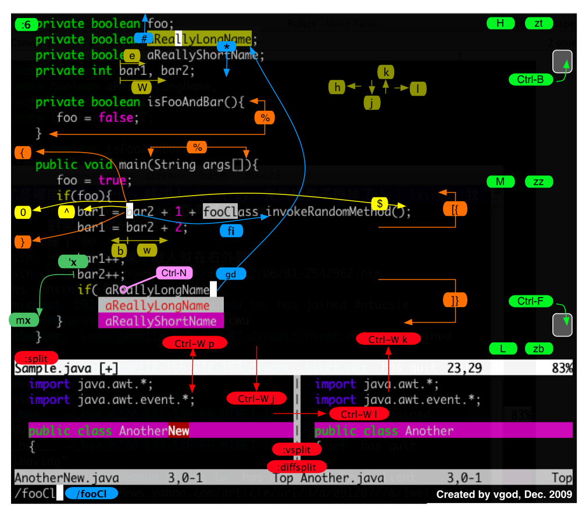

key-notation
===

在 vim 底行模式输入 `:h key-notation` 可以查看 vimdoc 的标记体例。

```Shell
                                        *key-notation* *key-codes* *keycodes*
These names for keys are used in the documentation.  They can also be used
with the ":map" command (insert the key name by pressing CTRL-K and then the
key you want the name for).
```

输入 `:h h`、`:h j`、`:h k`、`:h l` 分别查看常规模式下 h/j/k/l 按键的作用，定位到光标移动所在说明文档 motion.txt 中。

[给程式设计师的Vim入门图解说明](http://blog.vgod.tw/2009/12/08/vim-cheat-sheet-for-programmers/?variant=zh-cn)
===




[Graphical vi-vim Cheat Sheet and Tutorial](http://www.viemu.com/a_vi_vim_graphical_cheat_sheet_tutorial.html)

[Vi/Vim 键盘图](http://www.cnblogs.com/ldp-web/archive/2011/10/22/2220920.html)
===
[vim键盘图](http://km.oa.com/articles/show/68423)


