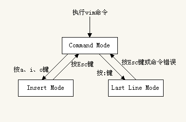

## [vi/vim 的三种模式](http://blog.csdn.net/motor87/article/details/5848501)
### 指令模式 vs 编辑模式
指令模式（Command Mode）/ 普通模式 下输入 `a`、`i`、`o` 切到编辑模式（Insert Mode）；  
编辑模式（Insert Mode） 下输入 `<Esc>` 切回指令模式（Command Mode）。

### 指令模式 vs 底行模式
指令模式（Command Mode）下输入 `:` 进入底行模式（Last line Mode）；  
底行模式（Last line Mode）下输入 `<Esc>` 或 指令错误 切回指令模式（Command Mode）。

### 编辑模式 vs 底行模式
编辑模式（Inset Mode）和 底行模式（Last line Mode）之间不能直接切换，需要退回**指令模式**切换。

## [vim 的几种模式](http://haoxiang.org/2011/09/vim-modes-and-mappin/)
vim的模式众多，但通常被提及的主要有以下几种。

### Normal Mode（n）
也就是最一般的普通模式，进入 vim 之后，默认处于这种模式。

### Visual Mode（v）
在普通模式下，可以按 `v` 键进入可视模式，在该模式下可利用方向键基于当前光标扩散**选定**一些字符、行、列。  
普通模式，一般针对 char、word、line 的操作，可视模式可看做**可针对选定块进行操作**的 ***增强*** Normal Mode。

### Insert Mode（i）
插入模式，其实就是指可编辑输入状态。普通模式下，可以按 **i** 进入。

### Select Mode (s)
**gvim** 常用模式，姑且称作**选择模式**吧。  
<del>用鼠标拖选区域的时候，就进入了选择模式。</del>  
和可视模式不同的是，在这个模式下，选择完了高亮区域后，敲任何按键就直接输入并替换选择的文本了，类似 GUI 编辑器选定编辑的效果。  
普通模式下按 `gh` 可进入 SELECT 模式，按下 `<esc>` 退回到普通模式。

### Command-Line/Ex Mode（c）
直译为命令行模式和 Ex 模式吧。  
两者略有不同，普通模式下按冒号 `:` 进入 bottom prompt Command-Line 模式，可以输入各种命令使用vim的各种强大功能。  
普通模式下按 `Q`（`<S-q>`）进入 Ex 模式，其实就是**多行**的 Command-Line 模式。

## vim 模式切换
### NORMAL -> VISUAL
参考：`/usr/share/vim/vim73/doc/visual.txt`。

按键         | 说明                | 备注
------------|---------------------|--------
`v`           | 普通模式切换到可视模式 | 从当前光标开始选择： - 通过 `h`/`l` 或 `b`/`w` 展开行内选择 - 通过`j`/`k`扩展行间选择
`V`(`<S-v>`)    | 普通模式切换到可视**行**模式 | VISUAL LINE： 针对整行选定模式
`<C-v>`       | 普通模式切换到可视**块**模式 | VISUAL BLOCK： 针对列块选定模式

**说明：**

> 对选中部分可以 `:w [FILENAME]` **另存为**文件（SELECTING TEXT TO WRITE：saves the Visually selected lines in file FILENAME）。

### NORMAL -> REPLACE

按键           | 说明                | 备注
--------------|--------------------|--------
`R`             | 一直替换光标所在的字符 | replace mode

### NORMAL -> INSERT
参考：`/usr/share/vim/vim73/doc/insert.txt`。

#### 当前光标 所在位置/行首 字符前插入

按键          | 说明                | 备注
-------------|---------------------|--------
`i`            | 从当前位置开始**插入** | insert before cursor
`I`            | 从本行行首（第一个非空白字元前面） 开始**插入** |  Insert text before the first non-blank in the line 等效于 `^i`

#### 当前光标 所在位置/行未 字符后插入

按键          | 说明                 | 备注
-------------|---------------------|--------
`a`            | 从当前字符开始**追加**     | append after cursor
`A`            | 从本行行尾开始**追加**     | Append text at the end of the line 等效于 `$a`

#### 当前光标所在行 上/下 插入新行

按键          | 说明                | 备注
-------------|---------------------|--------
`o`            | 在本行**下增一行**开始编辑  | open below
`O`            | 在本行**上增一行**开始编辑  | Open above

### NORMAL -> COMMAND LINE
参考：`/usr/share/vim/vim73/doc/cmdline.txt`。

在普通模式中，輸入『 : / ? 』三個中的任何一個键，就可以將光标移動到当前屏幕最底下那一行，即进入**底行模式**。

按键           | 说明                   | 备注
--------------|------------------------|--------
`:`           | 切入**底行模式** （Last Line Mode）| `<C-d>`：list possible completions； 可通过上下方向键翻阅[历史命令](http://blog.sina.com.cn/s/blog_5ac88b350100an4p.html)
`q:`          | 打开Command Line分屏窗口 | 可使用方向键翻看命令行历史记录（可编辑） 按下 `<CR>` 键执行；按下 `<C-c>` 可切回。
`Q`           | Ex Mode                | **多行**的 Command-Line 模式 输入`visual`(`vi`)可切回。
`:! {command}`	| 暂时离开 vim 运行某个终端命令 （EXECUTE EXTERNAL SHELL COMMAND） | 例如 `:! pwd` 暂时列出当前目录 按下 `<CR>` 键可切回到 vim。

### 返回 NORMAL 模式
按键           | 说明                   | 备注
--------------|------------------------|--------
`<C-c>`       | **CTRL-C**:Interrupt current (search) command;  **i_CTRL-C**: Quit insert mode, go back to Normal mode. | **CTRL-C** **i_CTRL-C**
`<Esc>` / `<C-[>` | End insert or Replace mode,  go back to Normal mode. | **i_\<Esc\>** **i_CTRL-\[**
