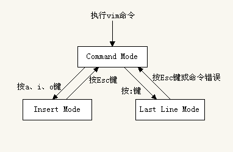

`:h mode-switching` 可查看 intro.txt 中的模式切换（Switching from mode to mode）相关的说明。

## [vi/vim 的三种模式](http://blog.csdn.net/motor87/article/details/5848501)

### 指令模式 vs 编辑模式
指令模式（Command Mode）/ 普通模式 下输入 `a`、`i`、`o` 切到编辑模式（Insert Mode）；  
编辑模式（Insert Mode） 下输入 `<Esc>` 切回指令模式（Command Mode）。

### 指令模式 vs 底行模式
指令模式（Command Mode）下输入 `:` 进入底行模式（Last line Mode）；  
底行模式（Last line Mode）下输入 `<Esc>` 或 指令错误 切回指令模式（Command Mode）。

### 编辑模式 vs 底行模式
编辑模式（Inset Mode）和 底行模式（Last line Mode）之间不能直接切换，需要退回**指令模式**切换。

## [vim 的几种模式](http://haoxiang.org/2011/09/vim-modes-and-mappin/)
vim的模式众多，但通常被提及的主要有以下几种。

### Normal Mode（n）
也就是最一般的普通模式，进入 vim 之后，默认处于这种模式。

### Visual Mode（v）
在普通模式下，可以按 `v` 键进入可视模式，在该模式下可利用方向键基于当前光标扩散**选定**一些字符、行、列。  
普通模式，一般针对 char、word、line 的操作，可视模式可看做 **可针对选定块进行操作**的 ***增强***  Normal Mode。

### Insert Mode（i）
插入模式，其实就是指可编辑输入状态。普通模式下，可以按 **i** 进入。

### Select Mode (s)
**gvim** 常用模式，姑且称作**选择模式**吧。  
<del>用鼠标拖选区域的时候，就进入了选择模式。</del>  
和可视模式不同的是，在这个模式下，选择完了高亮区域后，敲任何按键就直接输入并替换选择的文本了，类似 GUI 编辑器选定编辑的效果。  
普通模式下按 `gh` 可进入 SELECT 模式，按下 `<esc>` 退回到普通模式。

### Command-Line/Ex Mode（c）
直译为命令行模式和 Ex 模式吧。  
两者略有不同，普通模式下按冒号 `:` 进入 bottom prompt Command-Line 模式，可以输入各种命令使用vim的各种强大功能。  
普通模式下按 `Q`（`<S-q>`）进入 Ex 模式，其实就是**多行**的 Command-Line 模式。

#### [command-line history](http://vim.wikia.com/wiki/Using_command-line_history)
在正常模式下，输入 **`q:`** 将在源文档下方、[Command Line] 上方打开一个 vim 命令行历史分屏窗格（*command-line history*），同时进入底行 `:` 命令模式。  
按下 `:q` 或连按两次 `CTRL-C` 退出命令历史分屏窗格；或通过 `<Up>` `<Down>` 方向键（或 <kbd>j</kbd>  / <kbd>k</kbd>）翻看选中某条历史命令，再按下 `<Enter>` 键执行（命令）。  

> 执行 `:his` (`:history`) 可以查看执行命令的历史。  
> 输入 `@:` 可执行最近一条命令（ Repeat last command-line）。  

在正常模式下，输入 **`q/`** 或 **`q?`** 将在源文档下方、[Command Line] 上方打开 `/` 正向 或 `?` 反向搜索（**search** string）的历史分屏窗格，同时进入底行 `/` 或 `?` 搜索（查找）模式。  
按下 `:q` 或连按两次 `CTRL-C` 退出命令历史分屏窗格；或通过 `<Up>` `<Down>` 方向键（或 <kbd>j</kbd>  / <kbd>k</kbd>）翻看选中某条搜索历史，再按下 `<Enter>` 键执行（搜索）。  

> 执行 `:his /` (`:history /`) 可以查看正向搜索的历史。

## vim 模式切换

### NORMAL -> VISUAL
参考：`/usr/share/vim/vim[0-9][0-9]/doc/visual.txt`。

按键               | 说明                      | 备注
------------------|---------------------------|--------
`v`               | 普通模式切换到可视模式       | 从当前光标开始选择： - 通过 `h`/`l` 或 `b`/`w` 展开行内选择 - 通过`j`/`k`扩展行间选择
`V`(`<S-v>`)      | 普通模式切换到可视**行**模式 | VISUAL LINE： 针对整行选定模式
`<C-v>`           | 普通模式切换到可视**块**模式 | VISUAL BLOCK： 针对列块选定模式

**说明：**

> 对选中部分可以 `:w [FILENAME]` **另存为**文件（SELECTING TEXT TO WRITE：saves the Visually selected lines in file FILENAME）。

### NORMAL -> REPLACE

按键              | 说明                | 备注
-----------------|---------------------|--------
`R`              | 一直替换光标所在的字符 | replace mode

### NORMAL -> INSERT
参考：`/usr/share/vim/vim[0-9][0-9]/doc/insert.txt`。

#### 当前光标 所在位置/行首 字符前插入

按键             | 说明                 | 备注
----------------|----------------------|--------
`i`             | 从当前光标位置开始**插入** | insert before cursor
`I`             | 从本行行首（第一个非空白字元前面） 开始**插入** |  Insert text before the first non-blank in the line 等效于 `^i`

#### 当前光标 所在位置/行未 字符后插入

按键            | 说明                 | 备注
---------------|----------------------|--------
`a`            | 在当前字符后**追加**  | append after cursor
`A`            | 从本行行尾开始**追加**  | Append text at the end of the line 等效于 `$a`

#### 当前光标所在行 上/下 插入新行

按键            | 说明                     | 备注
---------------|--------------------------|--------
`o`            | 在本行**下面增一行**开始编辑 | open below
`O`            | 在本行**上面增一行**开始编辑 | Open above

### NORMAL -> COMMAND LINE
参考：`/usr/share/vim/vim[0-9][0-9]/doc/cmdline.txt`。

在普通模式中，輸入『 : / ? 』三個中的任何一個键，即可將光标移動到当前屏幕最底下那一行，即进入**底行模式**。

按键           | 说明                   | 备注
---------------|------------------------|--------
`:`            | 切入**底行模式** （Last Line Mode）| `<C-d>`：list possible completions； 可通过上下方向键翻阅[历史命令](http://blog.sina.com.cn/s/blog_5ac88b350100an4p.html)
`q:`           | 打开Command Line分屏窗口 | 可使用方向键翻看命令行历史记录（可编辑） 按下 `<CR>` 键执行；按下 `<C-c>` 可切回。
`Q`            | Ex Mode                | **多行**的 Command-Line 模式 输入`visual`(`vi`)可切回。
`:! {command}` | 暂时离开 vim 运行某个终端命令 （EXECUTE EXTERNAL SHELL COMMAND） | 例如 `:! pwd` 暂时列出当前目录 按下 `<CR>` 键可切回到 vim。

> 底行模式输入 *:linenumber* 可跳转到指定行。  
	> 输入 *:f* / *:fi* / *:file* 可在底部[查看当前打开文档的路径](http://blog.csdn.net/juneman/article/details/42425997)。  
> `:` 进入 vim 内部 Ex 命令执行环境；`!` 则可临时切换执行外部 shell 命令。   

#### Vim 与 Shell 切换

方法1：

**`Ctrl-z`** 命令将当前的 Vi/Vim 进程放到后台执行，之后 shell 环境即可为你所用；  
在 shell prompt 中执行 **`fg`** 命令则将位于后台的 Vi/Vim 进程切到前台恢复执行。  

方法2：

在 Vi/Vim 的正常模式下输入 **`:sh`** 即可进入 Linux/Unix shell 环境。  
在 shell prompt 中执行 **`exit`** 命令即可返回到 Vi/Vim 继续编辑。  

### 返回 NORMAL 模式
按键           | 说明                   | 备注
--------------|------------------------|--------
`<C-c>`       | **CTRL-C**:Interrupt current (search) command;  **i_CTRL-C**: Quit insert mode, go back to Normal mode. | **CTRL-C** **i_CTRL-C**
`<Esc>` / `<C-[>` | End insert or Replace mode,  go back to Normal mode. | **i_\<Esc\>** **i_CTRL-\[**
