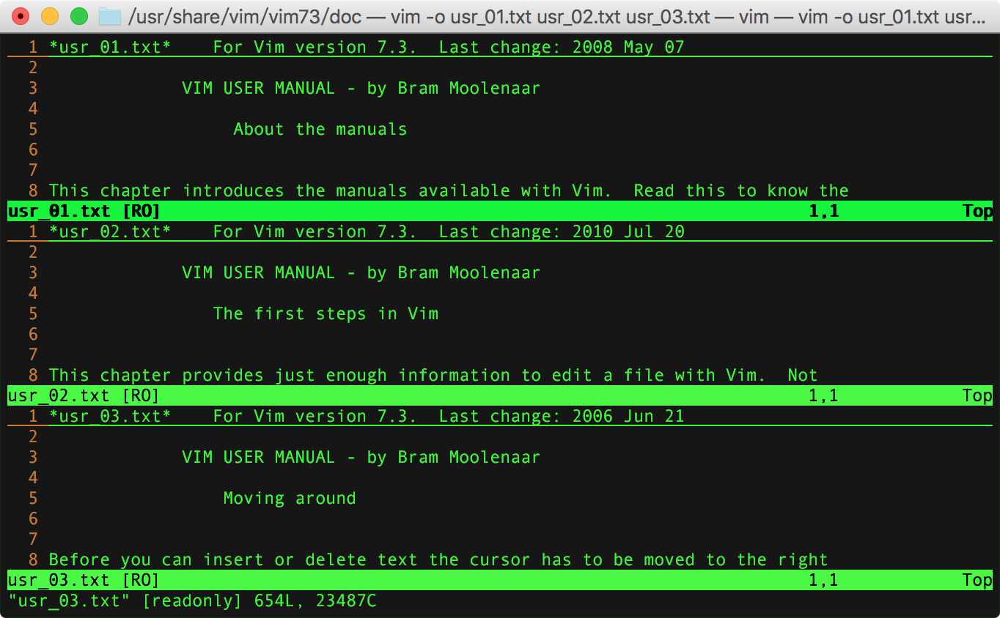
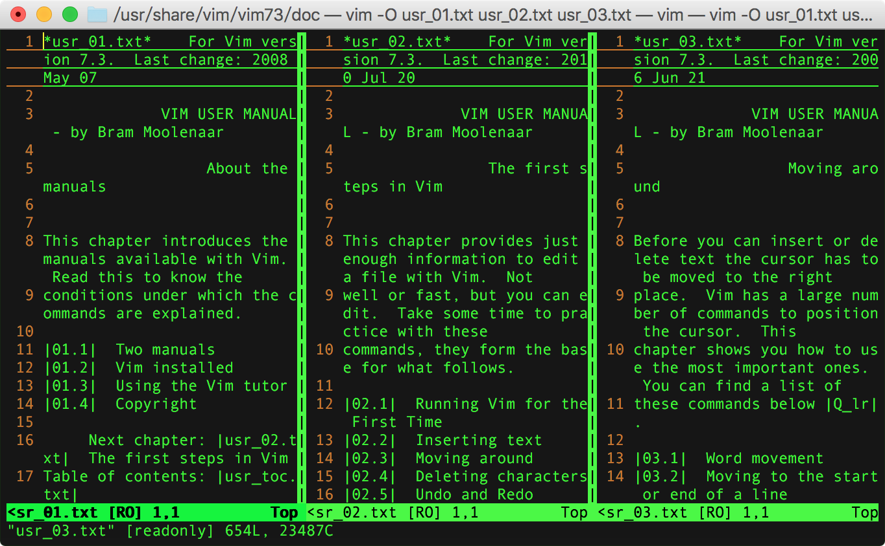
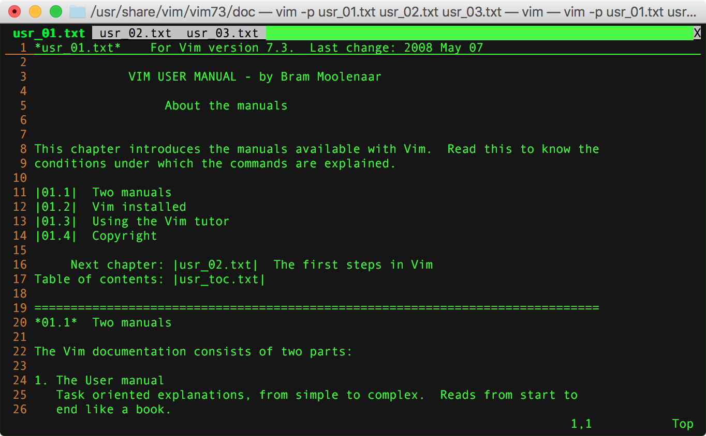

[vim在多个文件之间切换](http://www.cnblogs.com/hnrainll/archive/2011/04/29/2032662.html)  
[vim打开文档和多文档编辑](http://blog.csdn.net/huiguixian/article/details/6231425)

查看文件信息
----

按键           | 说明             | 备注
--------------|-----------------|--------
`:f` / `<C-g>`    | 查看当前文件信息   | 包括文件名、属性、行数、阅读进度、光标位置等信息
`1<C-g>`        | 查看当前文件信息   | 文件名为绝对路径
`:f {filename}` | 拷贝当前文档      | 类似`:w {filename}`

打开多个文件
----
### 当前vim窗口再打开/新建文件
前面我们在调用vim打开文件时，只带了一个文件参数。实际上，在编辑一个文件时，可以通过底行模式指令在当前窗口再打开或新建文件。

命令		          | 作用                | 备注
-----------------|---------------------|----------------------------
`:e {filename}` / `:open {filename}` | 当前窗口编辑（edit）文件，如果不存在则新建。<br/>如果当前文件有过修改会提示`No write since last change (add ! to override) `，需先保存或`!`强制覆盖。 | editing.txt
`:n {filename}`  | 当前窗口新建文件，如果已存在直接打开。<br/>如果当前文件有过修改会提示`No write since last change (add ! to override) `，需先保存或`!`强制覆盖。 | editing.txt
`:files` / `:buffers` / `:ls` | 列出目前**缓冲区**中的所有文档。<br/> `+` 表示缓冲区已经被修改过了；<br/> `＃` 代表上一次编辑的文档；<br/> `%` 是当前正在编辑的文档。 | windows.txt

### vim打开多个文件（argument list）
vim可以接多个文件名作为参数列表（argument list），同时打开多个文件：

```Shell
➜  ~  cd /usr/share/vim/vim73/doc
➜  doc  vim usr_01.txt usr_02.txt usr_03.txt
```

打开的这几个文件各自有对应的 swap buffer，但共用当前这一个编辑窗口，需要执行命令切换文件。

**多文档切换**

命令       | 说明         | 备注
----------|--------------|-------------
`:n`        | 编辑下一个文档 | 针对argument list，可参考editing.txt
`:N`        | 编辑上一个文档 | 针对argument list，可参考editing.txt
`:b {n}`    | 移至第n个文档（buffer） | n为`:files`/`:buffers`中的序号，可参考 windows.txt
`:bd {n}`   | 关闭（delete）第n个文档（buffer） | n为`:files`/`:buffers`中的序号，可参考 windows.txt
`:bn`       | 编辑下一个文档 | 针对buffers，可参考editing.txt
`:bN` / `:bp` | 编辑上一个文档 | 针对buffers，可参考editing.txt

**说明：**

> `:n`和`:N`只能针对 argument list 打开的多文件间进行切换，vim打开单文件或后期追加打开/编辑文件的将提示 `There is only one file to edit`。
> 对于多个正在编辑的file buffer，需要逐个 `:w` 保存，或者执行 `:qa`/`:qa!` 关闭全部退出 vim。

分屏窗口
----
参考： `/usr/share/vim/vim73/doc/windows.txt`

```Shell
➜  ~  vim --help
usage: vim [arguments] [file ..]       edit specified file(s)

Arguments:
   --			Only file names after this
   
   -o[N]		Open N windows (default: one for each file)
   -O[N]		Like -o but split vertically
   
```

以下调用 `vim -o` 同时打开3个文件，水平分屏：
 
```Shell
➜  doc  vim -o usr_01.txt usr_02.txt usr_03.txt
```



以下调用 `vim -O` 同时打开3个文件，垂直分屏：

```Shell
➜  doc  vim -O usr_01.txt usr_02.txt usr_03.txt
```



### 划分屏幕

命令		             | 作用
----------------------|---------------------
`:new`/`vnew`             | 创建一个新的分屏窗口
`:split`(`:sp`) / `vsplit`  | 将当前文档分割到一个新的窗口进行多屏显示
`:sf {filename}`        | 在新窗口中打开指定文件(必须已存在)
`:close` / `:q`           | 关闭当前窗口
`:only`                 | 关闭除当前窗口外所有窗口

### 切换分屏（`<C-w>`）

指令     | 作用
--------|---------------
`<C-w>w`  | 顺序循环切换窗口
`<C-w>h`  | 切换到左面的窗口
`<C-w>j`  | 切换到下面的窗口
`<C-w>k`  | 切换到上面的窗口
`<C-w>l`  | 切换到右面的窗口
`<C-w>t`  | 切换到顶部的窗口
`<C-w>b`  | 切换到底部的窗口
`<C-w>q`  | 关闭当前窗口，相当于 `:q` / `:close`

### 分屏示例
以下基于 `vim -O` 打开3个文件的垂直三列分屏再进行水平分屏：

1. 将光标切换聚焦到第一个窗口 `usr_01.txt` 上，执行 `:sp usr_04.txt` 在下面水平切割出的新窗口打开 `usr_04.txt`。
2. `<C-w>l`切换到 `usr_02.txt` 窗口，执行 `:sp usr_05.txt` 在下面水平切割出的新窗口打开 `usr_05.txt`。
3. `<C-w>l`切换到 `usr_03.txt` 窗口，执行 `:sp usr_06.txt` 在下面水平切割出的新窗口打开 `usr_06.txt`。

最终分割出六宫格布局：


多标签
----
> **REFERENCE MANUAL**: `/usr/share/vim/vim73/doc/tabpage.txt `
> **topic**: Editing with windows in multiple tab pages.
> **keyword**: *tab-page* *tabpage*

```Shell
➜  ~  vim --help
usage: vim [arguments] [file ..]       edit specified file(s)

Arguments:
   --			Only file names after this
   
   -p[N]		Open N tab pages (default: one for each file)
```

以下调用 `vim -p` 同时打开3个文件，分布在同一窗口的3各标签（tab page）：

```Shell
➜  ~  cd /usr/share/vim/vim73/doc
➜  doc  vim -p usr_01.txt usr_02.txt usr_03.txt
```



### 新建/关闭标签（OPENING A NEW TAB PAGE）

命令                    | 说明
-----------------------|--------------
`:tabe` / `:tabedit` / `:tabnew` | Open a new tab page with an empty window
`:tabs`  | List the tab pages and the windows they contain. <br/>- Shows a ">" for the current window; <br/>- Shows a "+" for modified buffers.
`:tabc` / `:tabclose` | Close current tab page <br/> you can specify the **tab index** that want to close.
`:tabo` / `:tabonly` |  Close all other tab pages.

### 切换标签（SWITCHING TO ANOTHER TAB PAGE）

命令    | 说明         | 备注
-------|--------------|-------------
`tabfir` / `:tabr` | Go to the first tab page. | `:tabfirst` / `:tabrewind`
`:tabl`          | Go to the last tab page.  | `:tablast`
`:tabn` / `:tabnext` / `gt` | Go to the next tab page. |  Wraps around from the last to the first one.<br/>you can specify the **tab index** that want to jump.
`:tabN` / `:tabp` / `:tabprevious` / `gT` | Go to the previous tab page. | Wraps around from the first one to the last one.<br/>you can specify the **tab index** that want to jump back.

