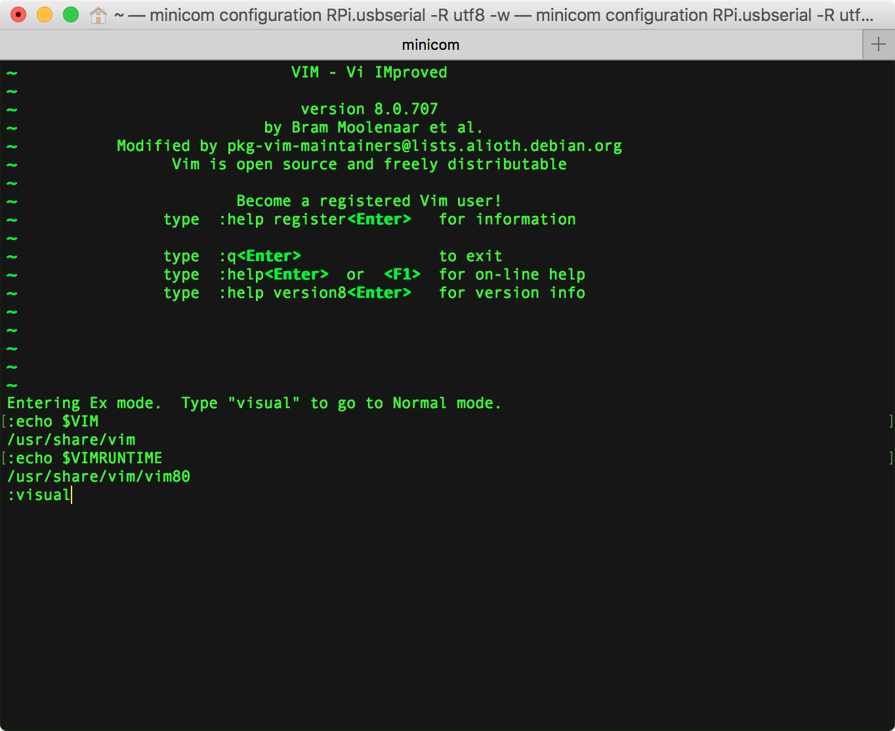
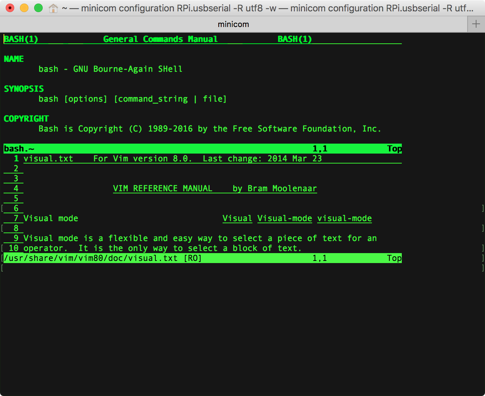

# [man.vim](http://www.vim.org/scripts/script.php?script_id=5615)  
[vim-man](https://github.com/vim-utils/vim-man) @ github  

man.vim 插件用于在 vim 底行模式通过 Man 命令启动分屏窗口作为 [man-page viewer](http://vim.wikia.com/wiki/Using_vim_as_a_man-page_viewer_under_Unix) 查看 man 帮助手册，这样可以一边使用 vim 编写程序，一边可以 man 程序 API 文档。  

## whereis
man.vim 插件是 vim 自带的，相关插件脚本存放在 `/usr/share/vim/vim[0-9][0-9]` 的 `/ftplugin/` 和  `/syntax/` 目录下：  

```Shell
# macOS
faner@THOMASFAN-MB0:~|⇒  ls /usr/share/vim/vim[0-9][0-9]/ftplugin/ | grep man
man.vim
manconf.vim

faner@THOMASFAN-MB0:~|⇒  ls /usr/share/vim/vim[0-9][0-9]/syntax/ | grep man
man.vim
manconf.vim
manual.vim
specman.vim
```

```Shell
# raspbian
pi@raspberrypi:~$ ls /usr/share/vim/vim[0-9][0-9]/ftplugin/ | grep man
manconf.vim
man.vim

pi@raspberrypi:~$ ls /usr/share/vim/vim[0-9][0-9]/syntax/ | grep man                            
manconf.vim
manual.vim
man.vim
specman.vim
```

## config & source
在 vim 编辑器中输入 <kbd>:</kbd> 进入单行命令模式或按下 <kbd>Q</kbd>（`<S-q>`）进入 Ex 多行命令行模式，再依次输入 `:echo $VIM` 和 `:echo $VIMRUNTIME` 即可检查 vim 环境变量。



如果已经定义环境变量 `VIMRUNTIME`，请略过步骤（1），直接实施步骤（2）。

（1）如果没有定义环境变量 `VIMRUNTIME`，则可执行 `vim ~/.vimrc` 打开编辑 vim 配置文件，增加以下行设置环境变量：

```Shell
" 配置环境变量，如果版本升级了要修改！                                      
let $VIMRUNTIME="/usr/share/vim/vim80"
set runtimepath=/usr/share/vim/vim80
```

（2）在配置文件中增加 source man.vim，使得每次启动 vim 时都加载 man.vim 插件：

```Shell
" 查看方法输入:Man api_name
source $VIMRUNTIME/ftplugin/man.vim
" 映射之后就可以少按一下 Shift 键。
cmap man Man
" 在普通模式下按下 K （大写）即可启动 man 查看光标下的函数。
nmap K :Man <cword><CR>
```

## usage
在 vim 编辑器输入 <kbd>:</kbd> 启动底行模式，在输入 `Man bash`，即可新建 Top 分屏窗口查看 bash 帮助手册：



## references

> [查看 Vim 里的 $VIM $VIMRUNTIME 环境变量](http://blog.csdn.net/laogaoav/article/details/20059331)  
> [vim中$VIMRUNTIME,runtimepath的环境变量设置](http://blog.csdn.net/rainysia/article/details/7067091)  
> [Vim插件之man.vim](http://blog.chinaunix.net/uid-12845622-id-2010581.html)  
> [man.vim 配置使用](http://www.cnblogs.com/eddy-he/archive/2012/09/13/vim_man.html)  
