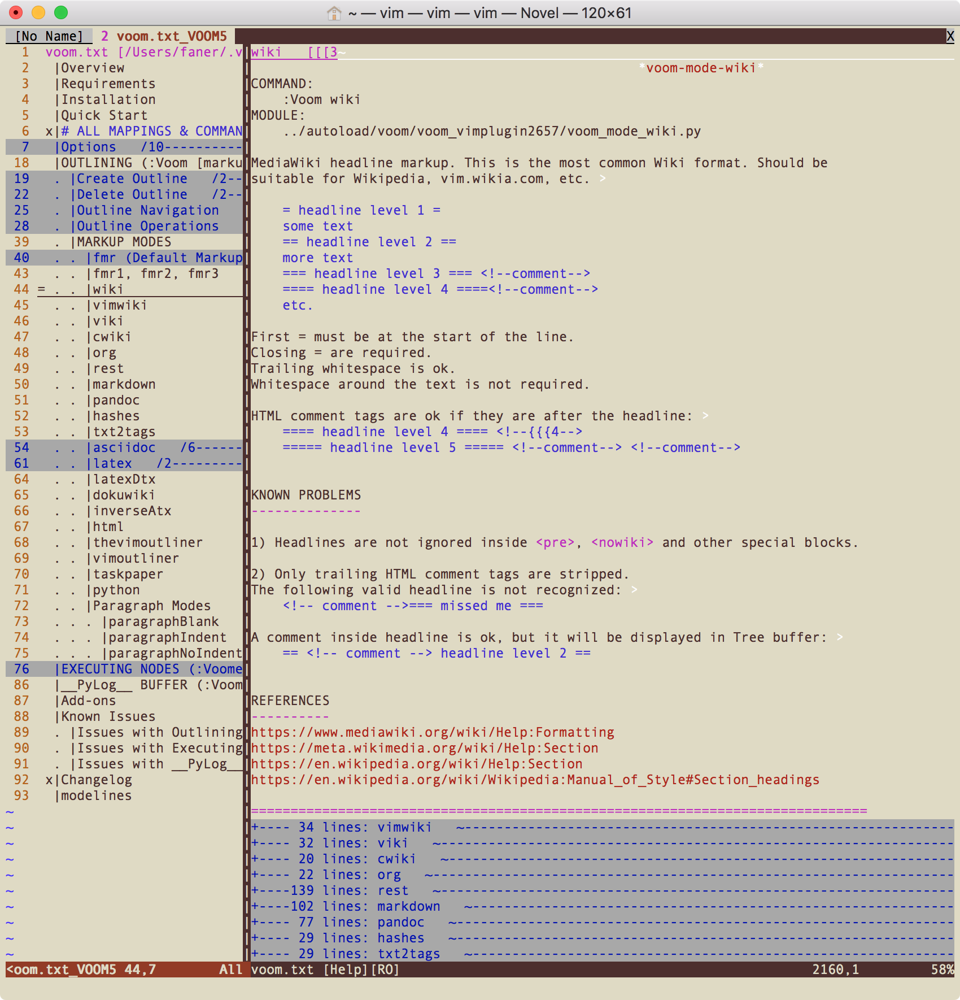
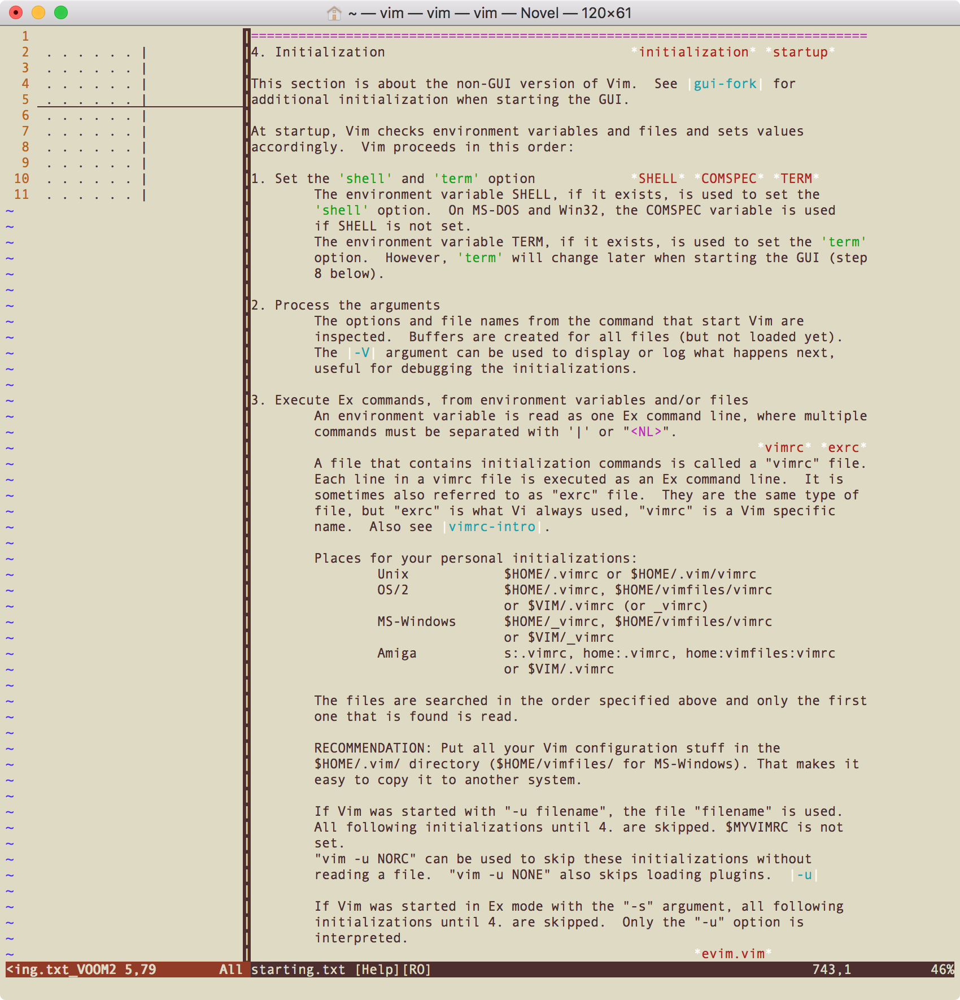
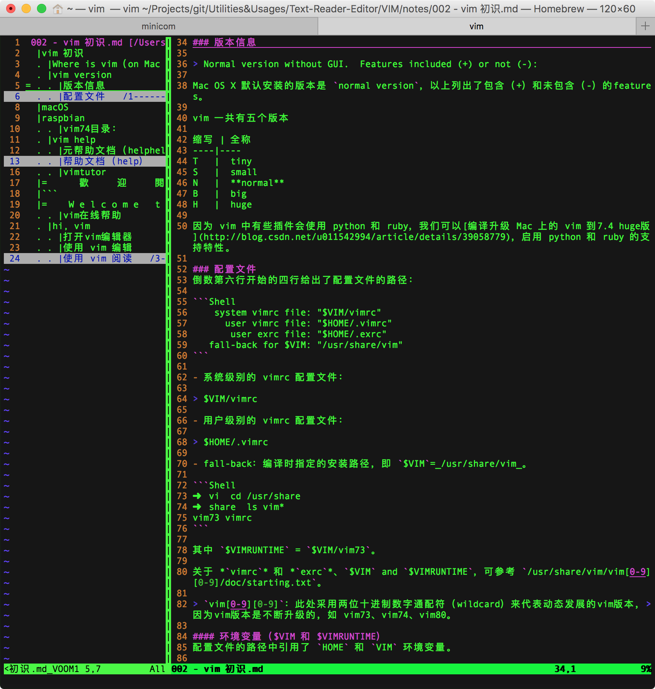

# [pathogen](http://www.vim.org/scripts/script.php?script_id=2332)
http://github.com/tpope/vim-pathogen

1. 下载 pathogen.vim 到 `~/.vim/autoload/` 目录下：

```Shell
pi@raspberrypi:~$ mkdir -p ~/.vim/autoload ~/.vim/bundle && \
curl -LSso ~/.vim/autoload/pathogen.vim https://tpo.pe/pathogen.vim
```

```Shell
# raspbian

pi@raspberrypi:~/.vim$ ls
autoload  bundle  doc  plugin
pi@raspberrypi:~/.vim$ ls autoload/
pathogen.vim  voom  voom.vim
```

```Shell
# macOS

faner@THOMASFAN-MB0:~|⇒  mkdir -p ~/.vim/autoload ~/.vim/bundle && \
curl -LSso ~/.vim/autoload/pathogen.vim https://tpo.pe/pathogen.vim
faner@THOMASFAN-MB0:~|⇒  ls .vim
autoload bundle
```

2. 编辑 `~/.vimrc`，添加以下行：

```
"开启pathogen插件管理器
set nocp
syntax on
filetype plugin indent on

"source ~/.vim/autoload/pathogen.vim "location of my pathogen.vim
set runtimepath+=~/.vim/autoload/pathogen.vim
call pathogen#infect()
call pathogen#helptags()
```

> [E117: Unknown function: pathogen#infect #50](https://github.com/tpope/vim-pathogen/issues/50)  
> [Vim Pathogen won't load - E117: Unknown function: pathogen#infect](https://stackoverflow.com/questions/13080490/vim-pathogen-wont-load-e117-unknown-function-pathogeninfect)  

如果之前已经在 `~/.vimrc` 中设置了 syntax on 和 filetype plugin indent on，这里可以不用重复添加。

- **安装插件**：配置好 pathogen 后，只需 git clone 插件的 github repo 到 `~/.vim/bundle` 目录即可完成插件的安装。  
- **更新插件**：只需 cd 到 `$HOME/.vim/bundle` 目录下，进入对应的插件目录，执行 `git pull origin` 即可。  
- **删除插件**：只需 cd 到 `$HOME/.vim/bundle` 目录下，将对应的插件目录删除即可。  

## 安装 VOom 插件
从  [VOoM](http://www.vim.org/scripts/script.php?script_id=2657) 插件（voom.vim）的 [GitHub mirror](https://github.com/vim-voom/VOoM) 克隆 github repo 到 `~/.vim/bundle/` 目录下：

```Shell
# raspbian

pi@raspberrypi:~$ cd .vim/bundle/
pi@raspberrypi:~/.vim/bundle$ git clone https://github.com/vim-voom/VOoM.git
Cloning into 'VOoM'...
remote: Counting objects: 107, done.
remote: Total 107 (delta 0), reused 0 (delta 0), pack-reused 107
Receiving objects: 100% (107/107), 307.45 KiB | 6.00 KiB/s, done.
Resolving deltas: 100% (55/55), done.
```

```Shell
# macOS

faner@THOMASFAN-MB0:~|⇒  cd .vim/bundle
faner@THOMASFAN-MB0:~/.vim/bundle|⇒  git clone https://github.com/vim-voom/VOoM.git
Cloning into 'VOoM'...
remote: Counting objects: 107, done.
remote: Total 107 (delta 0), reused 0 (delta 0), pack-reused 107
Receiving objects: 100% (107/107), 307.45 KiB | 10.00 KiB/s, done.
Resolving deltas: 100% (55/55), done.
Checking connectivity... done.
```

安装完插件后，一般还需执行 `:helptags ~/.vim/bundle/VOoM/doc/` 更新 help 标签库，这样即可通过 `:h voom.txt` 查看 voom 帮助。

或者在 VIM 底行模式输入 `:Voomhelp` 将新建 tab 页打开 voom 帮助文档。

> Open help file voom.txt as an outline in a new tabpage. 



### OUTLINING MarkupMode

[VOoM](https://vim-voom.github.io/) can work with headlines in the following formats:

- Start fold markers with level numbers (:Voom). This is the default or "fmr" mode: headlines are lines with {{{1, {{{2, {{{3, etc. Start fold markers are determined by Vim option 'fmr'. There are also variations of this mode: fmr1, fmr2, fmr3.    
- [MediaWiki](https://en.wikipedia.org/wiki/Help:Wiki_markup#Sections) (:Voom **wiki**).  
- [Vimwiki](https://github.com/vimwiki/vimwiki) (:Voom vimwiki).  
- [Emacs Org-mode](http://orgmode.org/) (:Voom **org**).  
- [reStructuredText](http://docutils.sourceforge.net/rst.html) (:Voom **rest**).  
- [Markdown](http://daringfireball.net/projects/markdown/) (:Voom **markdown**). Standard Markdown. Both Setext-style and Atx-style headers   are supported.  
- [Pandoc Markdown](http://pandoc.org/) (:Voom **pandoc**). This screenshot shows Pandoc README. Headlines inside fenced code blocks are   ignored, which makes this mode suitable for MultiMarkdown, GitHub Markdown, Markdown R, etc.  
- [LaTeX](http://en.wikipedia.org/wiki/LaTeX) (:Voom **latex**). This screenshot shows amshelp.tex.  
- .dtx files (:Voom **latexDtx**). Documented LaTeX sources.  
- [HTML heading tags](https://en.wikipedia.org/wiki/HTML_element#Basic_text) (:Voom html). Single lines only.  
- [The Vim Outliner](http://www.vim.org/scripts/script.php?script_id=517) (:Voom thevimoutliner).  
- [VimOutliner](https://github.com/vimoutliner/vimoutliner) (:Voom vimoutliner).  
- [TaskPaper](http://www.vim.org/scripts/script.php?script_id=2027) (:Voom taskpaper).  
- [Python](https://www.python.org/) code (:Voom **python**). Like a class browser, but regions between "class" and "def" are also nodes.  

执行 `:h vimrc` 打开 vim 标准 wiki 文档（`/usr/share/vim/vim[0-9][0-9]/doc/starting.txt`），输入 `:Voom wiki`（或 `:Voom vimwiki`） 即可在左侧新建分屏窗口展示 wiki 文档大纲（TOC）。



使用 vim 打开 `002 - vim 初识.md` 文档，输入 `:Voom markdown` 即可在左侧新建分屏窗口展示 markdown 文档大纲（TOC）。  



通过上下方向键可以切换阅读指定章节，或通过 <kbd>j</kbd>、<kbd>k</kbd> 再配合 <kbd>enter</kbd> 键切换阅读指定章节。  
通过快捷键 `CTRL-W_h` 或 `CTRL-W_l` 可在左侧TOC窗格和右侧正文窗格之间切换，输入 `:q` 退出当前窗口。  

### 其他类似插件
[TVO: The Vim Outliner ](http://www.vim.org/scripts/script.php?script_id=517) - old 2006  
[VimOutliner](http://www.vim.org/scripts/script.php?script_id=3515) @[github](https://github.com/vimoutliner/vimoutliner)  
[VimFlowy: The Simplest Outliner for VIM](https://rogerkeays.com/vimflowy)  

## 安装 vim-marked 插件
克隆 [vim-marked](https://github.com/itspriddle/vim-marked) 插件的 github repo 到 `~/.vim/bundle/` 目录下：

```Shell
faner@MBP-FAN:~|⇒  cd ~/.vim/bundle/ && git clone https://github.com/itspriddle/vim-marked.git
Cloning into 'vim-marked'...
remote: Counting objects: 130, done.
remote: Total 130 (delta 0), reused 0 (delta 0), pack-reused 130
Receiving objects: 100% (130/130), 18.15 KiB | 0 bytes/s, done.
Resolving deltas: 100% (31/31), done.
Checking connectivity... done.
faner@MBP-FAN:~/.vim/bundle|⇒  ls
VOoM       vim-marked
faner@MBP-FAN:~/.vim/bundle|⇒  cd vim-marked 
faner@MBP-FAN:~/.vim/bundle/vim-marked|master 
⇒  ls
README.markdown doc             plugin

```

使用说明（Usage）：

```Shell
:MarkedOpen[!]          Open the current Markdown buffer in Marked. Call with
                        a bang to prevent Marked from stealing focus from Vim.
                        Documents opened in Marked are tracked and closed
                        automatically when you quit Vim.

:MarkedQuit             Close the current Markdown buffer in Marked. Quits
                        Marked if there are no other documents open.

:MarkedToggle[!]        If the current Markdown buffer is already open in
                        Marked, calls :MarkedQuit. If not, calls
                        :MarkedOpen[!].
```

## references
[Vim下的插件管理工具pathogen简介](http://www.cnblogs.com/litifeng/p/5597565.html)  
[vim插件管理利器：pathogen](http://blog.csdn.net/zhaoyw2008/article/details/8012757)  
Vim插件管理:Pathogen安装：[参考1](http://blog.csdn.net/z460189852/article/details/51525728)，[参考2](http://blog.csdn.net/weixin_35934768/article/details/52640038)  
[使用vim-pathogen 进行插件管理](http://www.cnblogs.com/gtarcoder/p/4632325.html)  
