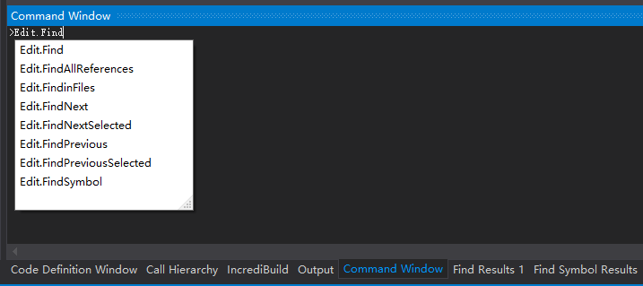
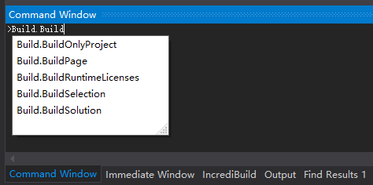
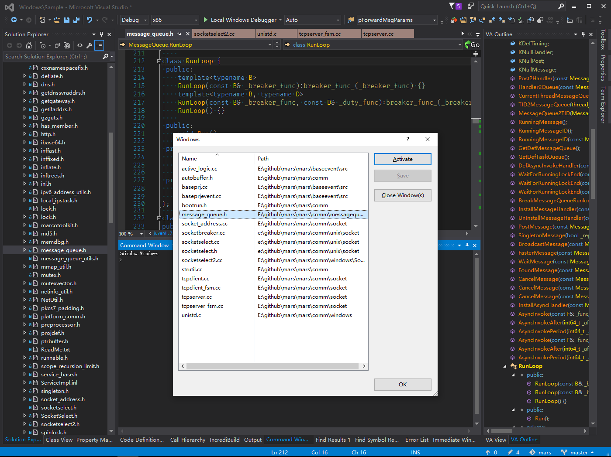
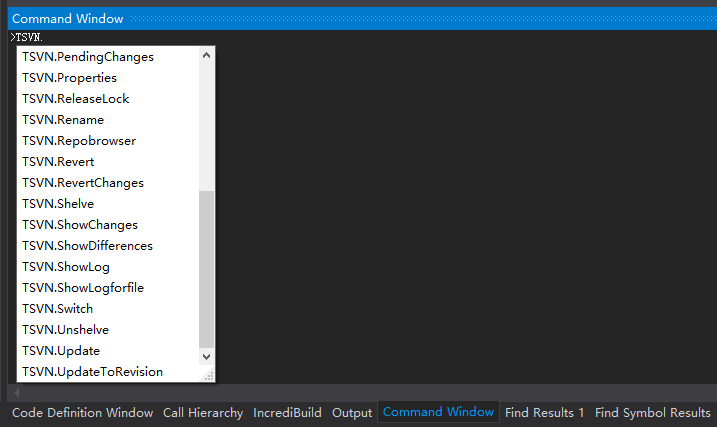
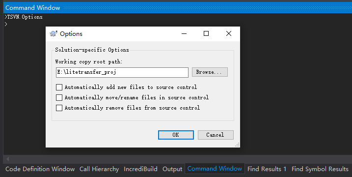

[Find/Command box](https://docs.microsoft.com/en-us/visualstudio/ide/find-command-box?view=vs-2017)  

[**Visual Studio Commands**](https://docs.microsoft.com/en-us/visualstudio/ide/reference/visual-studio-commands?view=vs-2017)  
[Visual Studio Command Aliases](https://docs.microsoft.com/en-us/visualstudio/ide/reference/visual-studio-command-aliases?view=vs-2017)  

## Command Window vs. Immediate Window

[Command Window](https://docs.microsoft.com/en-us/visualstudio/ide/reference/command-window?view=vs-2017)  
[Immediate window](https://docs.microsoft.com/en-us/visualstudio/ide/reference/immediate-window?view=vs-2017)  

通过菜单 View - Other Windows 或快捷键 `ctrl+alt+a` 可呼起 Command Window。
通过菜单 Debug - Windows - Immediate 或快捷键 `ctrl+alt+i` 可呼起 Immediate Window。

Command Window 行首的 `>` 为命令前导符，可输入执行命令。
Immediate Window 下没有 `>` 前导符，但是也可以输入 `>` 临时执行命令。

在 Command Window 中输入 `>immed`(Tools.ImmediateMode) 可以切换到 Immediate Window。
在 Immediate Window 中输入 `cmd`(View.CommandWindow) 可切换回 Command Window。

通过上下方向键可回看选择历史输入命令，输入 `cls` 清屏。

### The Equals (=) Sign

The window used to enter the `EvaluateStatement` command determines whether an equals sign (=) is interpreted as a comparison operator or as an assignment operator.

In the **Command** window, an equals sign (=) is interpreted as a <u>comparison</u> operator. You cannot use assignment operators in the **Command** window. So, for example, if the values of variables `varA` and `varB` are different, then the command `>Debug.EvaluateStatement(varA=varB)` will return a value of `False`.

In the **Immediate** window, by contrast, an equals sign (=) is interpreted as an <u>assignment</u> operator. So, for example, the command `>Debug.EvaluateStatement(varA=varB)` will assign to variable `varA` the value of variable `varB`.

## Menu Commands

输入菜单名（例如 File、Edit、View、Tools 等），再输入点号（`.`）会自动列出可用子命令智能提示。

### File

`>File.NewFile`：新建文件，等效菜单项 File | New；  
`>File.CloseSolution`：关闭当前工程项目，等效菜单项目 File | Close Solution；  

### Edit

`>Edit.GoTo`：输入跳转到指定行，等效菜单项目 Edit | Go To..；  
`>Edit.Find`：调起当前文件查找框，等效菜单项目 Edit | Find；  



Edit.Find 后面可以直接输入要查找的关键词，直接开始查找：

- `>Edit.Find SocketBreaker`：在当前文件查找 SocketBreaker；  
- `>Edit.FindinFiles RunLoop`：在当前工程（Solution）的所有文件中查找 SocketBreaker；  

### View

`>View.ClassViewSearch SocketBreaker`：打开类视图（Class View），并搜索 SocketBreaker 类：  

### Tools

`>Tools.Options`：打开 工具|选项 对话框，等效菜单 Tools | Options；  
`>Tools.ExtensionsandUpdates`：快速打开 Extensions and Updates 对话框；  

### Build

`>Build.Build`：Build | Build 相关构建命令：



如果安装了 [IncrediBuild](https://www.incredibuild.com/webhelp/IncrediBuild_solutions1.html)，可输入 `IncrediBuild.CleanSolution` 或 `IncrediBuild.BuildSolution` 清除/启动编译。

### Window

`>Window.Windows`：查看当前打开的所有文件，切换激活或关闭文件。



### extensions

如果安装了 [VAssistX](https://marketplace.visualstudio.com/items?itemName=WholeTomatoSoftware.VisualAssist) 插件，会集成 VAssistX 菜单。

- 命令 `>VAssistX.VAOutline` 可快速打开大纲视图。  
- 命令 `>VAssistX.EnableDisable` 可 [Enable and Disable](https://docs.wholetomato.com/default.asp?W214) VAssistX 插件。

> 调试之前可临时禁用 VAX 插件，避免调试期间 VA Parsing 可能导致卡死或崩溃。  

如果安装了 [TSVN](https://marketplace.visualstudio.com/items?itemName=SamirBoulema.TSVN) 插件，会集成 Tsvn 菜单，通过 `TSVN.` 系列命令可快速执行相关命令。

`>TSVN.ShowLog`：查看 svn logs，等效菜单项 Tsvn | Show Log...；



`>TSVN.Options`：查看 tsvn 配置，可以设置修改当前项目的 svn 根目录（Working copy root path）。



## Debug Commands

启动/停止调试相关命令：

| command                     | comment                           |
| --------------------------- | --------------------------------- |
| Debug.Start                 | 开始调试（F5）                    |
| Debug.BreakAll              | 中断程序运行，一般是在 runloop 中 |
| Debug.StopDebugging         | 停止调试（shift+F5）              |

断点调试相关命令：

| command                     | comment                           |
| --------------------------- | --------------------------------- |
| Debug.Breakpoints           | 打开断点列表                      |
| Debug.DataBreakpoint        | 新建数据断点                      |
| Debug.FunctionBreakpoint    | 新建函数符号断点                  |
| Debug.ToggleBreakpoint      | 下断点                            |
| Debug.EnableBreakpoint      | 激活断点                          |
| Debug.EnableAllBreakpoints  | 激活所有断点                      |
| Debug.DisableAllBreakpoints | 将所有断点置为失效状态            |

### [Print command](https://docs.microsoft.com/en-us/visualstudio/ide/reference/print-command?view=vs-2017)

Evaluates an expression or displays specified text.

| Command Name  | Alias | Complete Name |
| ------------- | ----- | ------------- |
| Print Command | `?`   | Debug.Print   |

```
>Debug.Print text
```

### [List Call Stack Command](https://docs.microsoft.com/en-us/visualstudio/ide/reference/list-call-stack-command?view=vs-2017)

Displays the current call stack.

| Command Name            | Alias       | Complete Name       | comment          |
| ----------------------- | ----------- | ------------------- | ---------------- |
| Call Stack window       | `CallStack` | Debug.CallStack     | 切换打开堆栈窗口 |
| List Call Stack Command | `kb`        | Debug.ListCallStack | 列举当前调用堆栈 |

```
Debug.ListCallStack [/Count:number] [/ShowTypes:yes|no]
[/ShowNames:yes|no] [/ShowValues:yes|no] [/ShowModule:yes|no]
[/ShowLineOffset:yes|no] [/ShowByteOffset:yes|no]
[/ShowLanguage:yes|no] [/IncludeCallsAcrossThreads:yes|no]
[/ShowExternalCode:yes|no] [Thread:n] [index]
```

/ShowValues:`yes`|`no` [or] /V:`yes`|`no`:  

> Optional. Specifies whether to display parameter values. Default value is `yes`.

/ShowModule:`yes`|`no` [or] /M:`yes`|`no`:  

> Optional. Specifies whether to display the module name. Default value is `yes`.

/IncludeCallsAcrossThreads:`yes`|`no` [or] /I:`yes`|`no`:  

> Optional. Specifies whether to include calls to or from other threads. Default value is `no`.

不显示 dll 模块名和参数值：`>Debug.ListCallStack /M:no /V:no`

### [List Memory Command](https://docs.microsoft.com/en-us/visualstudio/ide/reference/list-memory-command?view=vs-2017)

Displays the contents of the specified range of memory.

```
Debug.ListMemory [/ANSI|Unicode] [/Count:number] [/Format:formattype]
[/Hex|Signed|Unsigned] [expression]
```

### [List Registers Command](https://docs.microsoft.com/en-us/visualstudio/ide/reference/list-registers-command?view=vs-2017)

Displays the value of the selected registers and lets you modify the list of registers to show.

```
Debug.ListRegisters [/Display [{register|registerGroup}...]] [/List]
[/Watch [{register|registerGroup}...]]
[/Unwatch [{register|registerGroup}...]]
```
