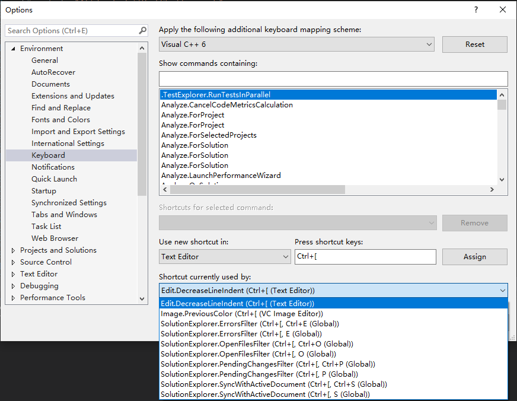

[Identifying and Customizing Keyboard Shortcuts in Visual Studio](https://docs.microsoft.com/en-us/visualstudio/ide/identifying-and-customizing-keyboard-shortcuts-in-visual-studio?view=vs-2015)  
[Default Keyboard Shortcuts in Visual Studio](https://docs.microsoft.com/en-us/visualstudio/ide/default-keyboard-shortcuts-in-visual-studio?view=vs-2015) and [Frequently Used Commands](https://docs.microsoft.com/en-us/visualstudio/ide/default-keyboard-shortcuts-for-frequently-used-commands-in-visual-studio?view=vs-2015)  

- [5 Great Shortcuts](https://vslive.com/Blogs/News-and-Tips/2015/04/5-VS-Keyboard-Shortcuts.aspx)  
- [149 Shortcuts](https://shortcutworld.com/Visual-Studio/win/Visual-Studio_2015_Shortcuts)  
- [Visual Studio 快捷键](http://jokinkuang.github.io/2016/10/11/VS-shortcut-keys.html)  
- [The complete list](http://visualstudioshortcuts.com/2015/)  

[VsVim](https://marketplace.visualstudio.com/items?itemName=JaredParMSFT.VsVim) - VIM emulation layer for Visual Studio

## Mapping Scheme

定制菜单路径：Tools->Options; Environment->Keyboard

默认的 Mapping Scheme 是 `Visual C++ 6`，可安装 [Hot Keys](https://marketplace.visualstudio.com/items?itemName=JustinClareburtMSFT.HotKeys-KeyboardShortcuts) 插件，添加 IntelliJ,ReSharper C# 的键盘映射。

## Navigation

### Solution

解决方案级别的全局操作：

| key    | command                       | comment          |
| ------ | ----------------------------- | ---------------- |
| ctrl+, | Edit.NavigateTo               | 文件及符号导航   |
| ctrl+; | Window.SolutionExplorerSearch | 解决方案全局搜索 |

1. `ctrl+[, ctrl+s`: Sync With Active Document？  
2. 考虑对齐 xcode/vscode，将 **`ctrl+shift+j`** 分配用作在解决方案中定位当前活动文件（Text Editor - *View.TrackActivityinSolutionExplorer*）。

### Tabs

文件标签页（DocumentWindow）相关导航操作：

| key            | command                          | comment                    |
| -------------- | -------------------------------- | -------------------------- |
| ctrl+tab       | Window.NextDocumentWindowNav     | 快速切换已打开文档         |
| ctrl+shift+tab | Window.PreviousDocumentWindowNav | 快速切换已打开文档（逆序） |
| ctrl+f6        | Window.NextDocumentWindow        | 下一个文档                 |
| ctrl+shift+f6  | Window.PreviousDocumentWindow    | 上一个文档                 |
| ctrl+f4        | Window.CloseDocumentWindow       | 关闭当前文档 tab           |

`ctrl+PgDn`/`ctrl+PgUp`：Window.NextTab/Window.PreviousTab？

以下为快速打开对应头文件和实现文件的操作：

| key            | command                                            | comment             |
| -------------- | -------------------------------------------------- | ------------------- |
| ctrl+k, ctrl+o | EditorContextMenus.CodeWindow.ToggleHeaderCodeFile | 切换头文件/实现文件 |

考虑安装 VAssistX，使用 **`alt+o`** 来 [Open Corresponding File](https://docs.wholetomato.com/default.asp?W195)。  

<!--  -->

通过 `ctrl+shift+g`（或 VAssistX 的 `alt+g`）可快速打开光标所在的 include 头文件。

### Trace

文档内编辑点 前进/后退 回溯：

| key          | command               | comment      |
| ------------ | --------------------- | ------------ |
| alt+left     | View.Backward         | 后退         |
| alt+right    | View.Forward          | 前进         |
| ctrl+-       | View.NavigateBackward | 后退         |
| ctrl+shift+- | View.NavigateForward  | 前进         |
| f4           | Edit.GoToNextLocation | 下一个位置   |
| shift+f4     | Edit.GoToPrevLocation | 上一个位置   |
| ctrl+g       | Edit.GoTo             | 跳转到指定行 |

当聚焦编辑时，`alt+right` 优先响应 Text Editor 的 Edit.CompleteWord。

### Symbols

代码文件内的符号导航：

| key      | command              | comment               |
| -------- | -------------------- | --------------------- |
| f12      | Edit.GoToDefinition  | 跳转到定义            |
| alt+f12  | Edit.PeekDefinition  | 浮窗打开定义，esc退出 |
| ctrl+f12 | Edit.GoToDeclaration | 跳转到声明            |

vs2015 中，没有 Edit.PeekDeclaration 命令，Edit.GoToDeclaration 同时占用了 `ctrl+f12` 和 `ctrl+alt+f12` 这两个快捷键：

浮窗中还可以继续 f12/alt+f12 生成多 tab 点，可通过以下快捷键对 Peek Float Tabs 进行切换。

| key        | command           | comment  |
| ---------- | ----------------- | -------- |
| ctrl+alt+- | Edit.PeekBackward | 浮窗后退 |
| ctrl+alt+= | Edit.PeekForward  | 浮窗前进 |

查找符号引用：

| key       | command            | comment    |
| --------- | ------------------ | ---------- |
| shift+f12 | Edit.GoToReference | 跳转到引用 |

考虑对齐 vscode，将 **`shift+alt+f12`** 分配用作 *Edit.FindAllReferences*。

#### navigation bar

[Shortcut to navigate members in Visual Studio](https://stackoverflow.com/questions/9131507/navigation-bar-gone-since-vs-11-install)  
[Is there a hotkey in Visual Studio to open the member drop down list?](https://stackoverflow.com/questions/1454642/is-there-a-hotkey-in-visual-studio-to-open-the-member-drop-down-list)  

开关配置路径：

> Tools -> Options -> Text Editor -> [Your Language] "Navigation bar"

`ctrl+f8`: Window.MoveToNavigationBar，可通过 tab 变焦。

#### list members

输入智能提示：

`ctrl+j`: Edit - IntelliSence - List Members  
`ctrl+alt+t`: Edit.ListMembers  

#### call stack

`ctrl+alt+k`: View.CallHierarchy（View | Call Hierarchy），无效？  
`ctrl+k, ctrl+t`: EditorContextMenus.CodeWindow.ViewCallHierarchy，函数调用堆栈。  

## ReSharp

### Comment

VS 默认的 注释/取消注释 操作是多组复合快捷键：

| key            | command                 | comment  |
| -------------- | ----------------------- | -------- |
| ctrl+k, ctrl+c | Edit.CommentSelection   | 注释     |
| ctrl+k, ctrl+u | Edit.UncommentSelection | 取消注释 |

考虑对齐 vscode，将 **`ctrl+/`** 分配给 Text Editor - *VAssistX.SelectionToggleLineComment*，用作快速注释/取消注释。这个快捷键默认对应 Global - Tools.GoToCommandLine 命令。

### Indent

考虑对齐 xcode、vscode，为 增加/减少 缩进 分配快捷键：

| key    | command                 | comment     |
| ------ | ----------------------- | ----------- |
| ctrl+] | Edit.IncreaseLineIndent | Text Editor |
| ctrl+[ | Edit.DecreaseLineIndent | Text Editor |

`ctrl+]` 默认用作 Text Editor - *Edit.GotoBrace*，下面有重新分配。

### Fold

| key            | command                       | comment           |
| -------------- | ----------------------------- | ----------------- |
| ctrl+m, ctrl+o | Edit.CollapsetoDefinitions    | 折叠所有          |
| ctrl+m, ctrl+l | Edit.ToggleAllOutlining       | 展开所有          |
| ctrl+m, ctrl+m | Edit.ToggleOutliningExpansion | 折叠/展开当前区块 |

- `CTRL+M,CTRL+O`: 折叠所有代码  
- `CTRL+M,CTRL+L`: 展开所有代码  
- **`Ctrl+M,CTRL+M`**: 折叠/展开当前层级代码块  

#### Region

VS 还提供了对光标所在的代码区块的收折快捷操作：

| key            | command                    | comment  |
| -------------- | -------------------------- | -------- |
| ctrl+m, ctrl+s | Edit.CollapseCurrentRegion | 折叠区域 |
| ctrl+m, ctrl+e | Edit.ExpandCurrentRegion   | 展开区域 |

**注意**：这里是指以括号闭包的代码区块，不是指 [pragma region](https://docs.microsoft.com/en-us/cpp/preprocessor/region-endregion?view=vs-2017)。

## Edit

| key                   | command                |
| --------------------- | ---------------------- |
| ctrl+del              | Edit.WordDeleteToEnd   |
| ctrl+bkspce           | Edit.WordDeleteToStart |
| ctrl+z                | Edit.Undo              |
| ctrl+y / ctrl+shift+z | Edit.Redo              |

### Line

#### Insert

| key              | command            | comment            |
| ---------------- | ------------------ | ------------------ |
| ctrl+enter       | Edit.LineOpenAbove | 当前行上面新增一行 |
| ctrl+shift+enter | Edit.LineOpenBelow | 当前行下面新增一行 |

> 建议交换过来，对齐 vscode。

#### Move

| key      | command                    |
| -------- | -------------------------- |
| alt+down | Edit.MoveSelectedLinesDown |
| alt+up   | Edit.MoveSelectedLinesUp   |

#### Copy/Cut

| key          | command         | comment        |
| ------------ | --------------- | -------------- |
| ctrl+c       | Edit.Copy       | 复制光标所在行 |
| ctrl+x       | Edit.Cut        | 剪切光标所在行 |
| ctrl+l       | Edit.LineCut    | 剪切当前行     |
| ctrl+shift+l | Edit.LineDelete | 删除当前行     |

> **注意**：当没有选择内容时，操作针对当前行。

### Selection

`ctrl+[` / `ctrl+]` 已经被重新分配给了缩进操作，这里对齐 vscode 重新分配括号跳转的快捷键：

| key              | command              | comment      |
| ---------------- | -------------------- | ------------ |
| ctrl+shift+\     | Edit.GotoBrace       | 匹配括号跳转 |
| ctrl+shift+alt+\ | Edit.GotoBraceExtend | 匹配括号块选 |

**注意**：`ctrl+shift+\` 默认绑定的是 Global - View.PowerShellInteractiveWindow。

### ColumnSelect

| key            | command                   | comment                             |
| -------------- | ------------------------- | ----------------------------------- |
| shift+down     | Edit.LineDownExtend       | 向下扩行选
| shift+alt+down | Edit.LineDownExtendColumn | Line Down Extend Column（向下列增） |
| shift+up       | Edit.LineUpExtend         | 向上扩行选
| shift+alt+up   | Edit.LineUpExtendColumn   | Line Up Extend Column（向上列增）   |

列选后，放下按键，重新按下 shift 辅以左右方向键可实现列块横向扩选。

**注意**：vscode 中的 shift+alt+down/up 为 copyLinesDownAction/copyLinesUpAction。

## Find

| key                   | command                                           |
| --------------------- | ------------------------------------------------- |
| ctrl+shift+f          | Edit.FindinFiles                                  |
| ctrl+f                | Edit.Find                                         |
| f3/shift+f3           | Edit.FindNext / Edit.FindPrevious                 |
| ctrl+f3/ctrl+shift+f3 | Edit.FindNextSelected / Edit.FindPreviousSelected |
| ctrl+shift+down/up    | Next/Previous Highlighted Reference               |
| ctrl+h                | Replace                                           |
| `Alt+F3, S`           | Edit.StopSearch                                   |

## VAssistX

VAX 插件主要为 VS 提供了增强的 SolutionExplorer 全局文件及符号（Symbols）导航、引用（References）查找能力。

[Keyboard Shortcuts](https://docs.wholetomato.com/default.asp?W375) - [List](https://www.wholetomato.com/learn/keyboardShortcuts)

| key         | command                           | comment                         |
| ----------- | --------------------------------- | ------------------------------- |
| alt+o       | VAssistX.OpenCorrespondingFile    | h/cpp，aspx/cs/vb               |
| shift+alt+o | VAssistX.OpenFileInSolutionDialog | VA View [Files in Solution]）   |
| alt+m       | VAssistX.ListMethodsInCurrentFile |                                 |
| shift+alt+s | VAssistX.FindSymbolDialog         | VA View [Symbols in Solution]） |
| alt+g       | VAssistX.GotoImplementation       | same as native F12              |
| shift+alt+f | VAssistX.FindReferences           | Find All references             |

考虑将 `shift+alt+m` 分配给 *VAssistX.GotoMember*，以对话框形式打开当前光标所在类的成员函数列表。

其他快捷操作：

| key          | command                         | comment                                              |
| ------------ | ------------------------------- | ---------------------------------------------------- |
| shift+alt+g  | VAssistX.GotoRelated            |                                                      |
| shift+alt+r  | VAssistX.RefactorRename         |                                                      |
| ctrl+shift+v | VAssistX.Paste                  | View multiple clipboards                             |
| shift+alt+]  | VAssistX.SmartSelectExtend      | Smart Select to initiate or extend a selection       |
| alt+]        | VAssistX.SmartSelectExtendBlock | Smart Select to initiate or extend a block selection |
| shift+alt+[  | VAssistX.SmartSelectShrink      | Smart Select to decrease a selection                 |
| alt+[        | VAssistX.SmartSelectShrinkBlock | Smart Select to decrease a block selection           |

`ctrl+shift+v` 默认用作 Global - View.CodeDefinitionWindow 打开代码定义窗口，这里被 VAssistX.Paste 覆盖。
如有需要，可考虑分配 **`ctrl+alt+f12`** 用作 Text Editor - View.CodeDefinitionWindow。

### navigation bar

安装 VAX 后，默认开启了 VA Navigation Bar，可通过 `Alt+M` 弹出符号列表并支持即时搜。

建议禁用 VS 自带的导航工具栏：Tools -> Options -> Text Editor -> [Your Language] "Navigation bar"。

### View & Outline

VAssistX - Tools - VA View, VA Outline

- [VA View](https://docs.wholetomato.com/default.asp?W222)  
- [VA Outline](https://docs.wholetomato.com/default.asp?W187)  

The **VA View** has four components, each of which is documented separately:

- Files in Solution drop-down  
- Symbols in Solution drop-down  
- Most Recently Used List (MRU)  
- Hovering Class Browser (HCB) with integrated Header Hierarchy  

The **VA Outline** is a tool window of Visual Assist that provides a synchronized, high-level view of the contents of the current source window.

可以右键多选函数，然后 Surround With 添加 comment 或 if、region 宏块。

## misc

### [pragma region](https://docs.microsoft.com/en-us/cpp/preprocessor/region-endregion?view=vs-2017)

（[cross-platform-code-label-macro](https://stackoverflow.com/questions/32468793/cross-platform-code-label-macro)）。

1. 可考虑为 `View.TemplateRegionLabels` 分配快捷键，以便快速插入区域闭合宏块。  
2. 可考虑为 `VAssistX.SurroundSelectionWithIfdefOrRegion` 分配快捷键，快速为代码块闭合插入区域宏。  
