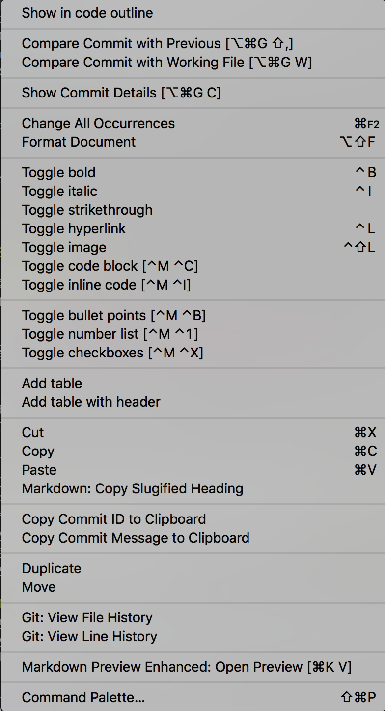

[TOC]

<!-- TOC -->

## markdown basics

### bold

`**BOLD**`：**BOLD**

### italic

`*italic*`：*italic*

### strikethrough

`~~strikethrough~~`：~~strikethrough~~

### hyperlink

`[Visual Studio Code - Code Editing. Redefined](https://code.visualstudio.com/)
`:

[Visual Studio Code - Code Editing. Redefined](https://code.visualstudio.com/)

### image

``:


### inline code

\`inline code\`：`inline code`

### code block

javascript 代码示例：

\`\`\`javascript
javascript codeblock
\`\`\`

```javascript
var http = require('http');

console.log('create http server by javascript!');

http.createServer(function (req, res) {
    res.writeHead(200, {'Content-Type': 'text/plain'});
    res.end('Hello World!');
}).listen(8080);
```

python 代码示例：

\`\`\`python
python codeblock
\`\`\`

```python
# main entry
if __name__ == '__main__':
    print('This program is being run by itself')
    if len(sys.argv) < 2:
        print('please input module name')
    else:
        main(sys.argv[1:])
else:
    print('I am being imported from another module')
```

### bullet points

[marketplace](https://marketplace.visualstudio.com/) categories

- Featured  
- Trending  
- [Most Popular](https://marketplace.visualstudio.com/search?sortBy=Downloads&category=All%20categories&target=VSCode)  
- [Recently Added](https://marketplace.visualstudio.com/search?sortBy=PublishedDate&category=All%20categories&target=VSCode)  

### number list

Most Popular Extensions in marketplace:

1. Python  
2. C/C++  
3. Debugger for Chrome  
4. ESLint  
5. vscode-icons  
6. C#  

### checkboxes

`- [ ]`: unchecked  
`- [x]`: checked  

some preferences of User Settings:

- [x] "editor.wordWrap": "on",
- [x] "terminal.integrated.cursorBlinking": true,
- [x] "gitlens.historyExplorer.enabled": true,
- [ ] "sync.autoDownload": false,
- [ ] "sync.autoUpload": false,
- [x] "powermode.enabled": true,

> 默认的 preview 不支持列选框，可安装 MPE（Markdown Preview Enhanced）插件支持。

## [Markdown All in One](https://marketplace.visualstudio.com/items?itemName=yzhang.markdown-all-in-one)

| Key               | Command                      |
| ----------------- | ---------------------------- |
| Ctrl + B          | Toggle bold                  |
| Ctrl + I          | Toggle italic                |
| Alt + S           | Toggle strikethrough         |
| Ctrl + Shift + ]  | Toggle heading (uplevel)     |
| Ctrl + Shift + [  | Toggle heading (downlevel)   |
| Ctrl + M          | Toggle math environment      |
| Alt + C           | Check/Uncheck task list item |
| Ctrl + Shift + V  | Toggle preview               |
| Ctrl + K V        | Toggle preview to side       |

- <kbd>⌘</kbd><kbd>B</kbd> : Toggle **bold**  
- <kbd>⌘</kbd><kbd>I</kbd> : Toggle *italic*  
- <kbd>⌥</kbd><kbd>S</kbd> : Toggle ~~strikethrough~~  
- <kbd>^</kbd><kbd>⇧</kbd><kbd>[</kbd> / <kbd>^</kbd><kbd>⇧</kbd><kbd>]</kbd>：increase/decrease level of heading
- <kbd>⌥</kbd><kbd>C</kbd> : 对任务列表行（`- [ ] item`）进行选中或反选  
- **<kbd>⌥</kbd><kbd>⇧</kbd><kbd>F</kbd>** : 对选中的表格进行排版对齐优化（Table Formatter）  
- <kbd>⌘</kbd><kbd>⇧</kbd><kbd>V</kbd> : Toggle preview，与 paste 全局冲突，可补充限制条件  
- <kbd>⌘</kbd><kbd>K</kbd><kbd>V</kbd> : Toggle preview to side，在侧边新开窗口预览  

Markdown All in One(MAO) 插件在 Preferences - User Settings 中的配置前缀为 `markdown.extension.`：

```json
    // Use `*` or `_` to wrap italic text
    "markdown.extension.italic.indicator": "*"

    // Use `-`, `*` or `+` in the table of contents (for unordered list)
    "markdown.extension.toc.unorderedList.marker": "-"
```

MAO 插件在 Preferences - Keyboard Shorts 中的命令前缀也是 `markdown.extension.`：

```json
    {
        "key": "ctrl+k v",
        "command": "markdown.extension.togglePreviewToSide",
        "when": "!terminalFocus"
    },
```

## [Markdown Shortcuts](https://marketplace.visualstudio.com/items?itemName=mdickin.markdown-shortcuts)

Context and title menu integration:



> 同类插件：Markdown helper

| Name                            | Description                                      | Default key binding  |
| ------------------------------- | ------------------------------------------------ | -------------------- |
| md-shortcut.showCommandPalette  | Display all commands                             | ctrl+M ctrl+M        |
| md-shortcut.toggleBold          | Make **bold**                                    | ctrl+B               |
| md-shortcut.toggleItalic        | Make _italic_                                    | ctrl+I               |
| md-shortcut.toggleStrikethrough | Make ~~strikethrough~~                           | ⌥S(MAO)             |
| md-shortcut.toggleHyperlink     | Make [a hyperlink](https://www.sogo.com)         | ctrl+L               |
| md-shortcut.toggleImage         | Make an image ``               | ctrl+shift+L         |
| md-shortcut.toggleCodeBlock     | Make ```a code block```                          | ctrl+M ctrl+C        |
| md-shortcut.toggleInlineCode    | Make `inline code`                               | ctrl+M ctrl+I        |
| md-shortcut.toggleBullets       | Make * bullet point                              | ctrl+M ctrl+B        |
| md-shortcut.toggleNumbers       | Make 1. numbered list                            | ctrl+M ctrl+1        |
| md-shortcut.toggleCheckboxes    | Make - [ ] check list (Github flavored markdown) | ctrl+M ctrl+X        |
| md-shortcut.toggleTitleH1       | Toggle # H1 title                                | ^⇧1(map)             |
| md-shortcut.toggleTitleH2       | Toggle ## H2 title                               | ^⇧2(map)             |
| md-shortcut.toggleTitleH3       | Toggle ### H3 title                              | ^⇧3(map)             |
| md-shortcut.toggleTitleH4       | Toggle #### H4 title                             | ^⇧4(map)             |
| md-shortcut.toggleTitleH5       | Toggle ##### H5 title                            | ^⇧5(map)             |
| md-shortcut.toggleTitleH6       | Toggle ###### H6 title                           | ^⇧6(map)             |
| md-shortcut.addTable            | Add Tabular values                               |                      |
| md-shortcut.addTableWithHeader  | Add Tabular values with header                   |                      |

Markdown Shortcuts 插件在 Preferences - User Settings 中的配置前缀为 `markdownShortcuts.`：

```json
    // Bullets marker
    "markdownShortcuts.bullets.marker": "*",
```

Markdown Shortcuts 插件在 Preferences - Keyboard Shorts 中的命令前缀为 `md.shortcut.`：

```json
    {
        "key": "ctrl+b",
        "command": "md-shortcut.toggleBold",
        "when": "editorTextFocus && markdownShortcuts:enabled"
    },
```

### 前导控制

Markdown Shortcuts 的列表和代码（块）相关快捷键都是以 `ctrl+m` 作为前导，macOS 下若开启了 Sublime Text Keymap 插件，则 `ctrl+m` 将被映射为 "editor.action.jumpToBracket"。Windows 下的 `ctrl+m` 命令被 toggleTabFocusMode 和 jumpToBracket 占用。

由于快捷键优先响应 User 用户级别的覆盖绑定，因此将 `md-shortcut.showCommandPalette` 命令的快捷键控制元组信息从 Default 拷贝到 User 中，即可解决 Windows 下的前导失灵问题：

```json
    {
        "key": "ctrl+m ctrl+m",
        "command": "md-shortcut.showCommandPalette",
        "when": "editorTextFocus && markdownShortcuts:enabled"
    },
```

下面以 FoldingText 为基准，调整或新增部分 shortcuts keybindings。

### 标题等级

`shift+command+[/]` 在 macOS 下为通用的左右 tab 切换，因此维持 MAO 以 ctrl 作为前导的标题等级升降快捷键：<kbd>^</kbd><kbd>⇧</kbd><kbd>[</kbd> / <kbd>^</kbd><kbd>⇧</kbd><kbd>]</kbd>。

FoldingText 下设置标题等级的快捷键为 `⌘1` ~ `⌘6`，在 macOS 下为分组标签索引定位。对齐 MAO 的标题等级升降快捷键，可为 `md-shortcut.toggleTitleH1 ~ 6` 分配相同前导的快捷键：<kbd>^</kbd><kbd>⇧</kbd><kbd>1</kbd> ~ <kbd>^</kbd><kbd>⇧</kbd><kbd>6</kbd>。

可修改 `~/Library/Application Support/Code/User/keybindings.json` 对应快捷键唤起的条件 when：

1. 聚焦编辑，非聚焦终端（!terminalFocus）：`editorTextFocus`  
2. 开启了 Markdown Shortcuts：`markdownShortcuts:enabled`  
3. Language Mode 为 markdown：`editorLangId == 'markdown'`，可选  

```json
    {
        "key": "ctrl+shift+1",
        "command": "md-shortcut.toggleTitleH1",
        "when": "editorTextFocus && markdownShortcuts:enabled"
    },

    {
        "key": "ctrl+shift+6",
        "command": "md-shortcut.toggleTitleH6",
        "when": "editorTextFocus && markdownShortcuts:enabled"
    },
```

#### 同名默认绑定

```json
    {
        "key": "ctrl+shift+5",
        "command": "workbench.action.terminal.split",
        "when": "terminalFocus"
    },
```

Windows 下的 `ctrl+shift+1` 默认被以下命令占用：

- editor.action.replaceOne,  
- search.action.replace,  
- search.action.replaceAllInFile,  
- search.action.replaceAllInFolder,  

### 粗斜删

维持 MAO 和 Markdown Shortcuts 双重快捷键。

```json
    {
        "key": "cmd+b",
        "command": "markdown.extension.editing.toggleBold",
        "when": "editorTextFocus && !editorReadonly && editorLangId == 'markdown'"
    },
    {
        "key": "ctrl+b",
        "command": "md-shortcut.toggleBold",
        "when": "editorTextFocus && markdownShortcuts:enabled"
    },

    {
        "key": "cmd+i",
        "command": "markdown.extension.editing.toggleItalic",
        "when": "editorTextFocus && !editorReadonly && editorLangId == 'markdown'"
    },
    {
        "key": "ctrl+i",
        "command": "md-shortcut.toggleItalic",
        "when": "editorTextFocus && markdownShortcuts:enabled"
    },
```

macOS 下直接复用 MAO 的删除符快捷键（`alt+s`），无需为 `md-shortcut.toggleStrikethrough` 新增快捷键。

```json
    {
        "key": "alt+s",
        "command": "markdown.extension.editing.toggleStrikethrough",
        "when": "editorTextFocus && !editorReadonly && editorLangId == 'markdown'"
    },
```

Windows 下如果安装了 SVN 插件，`alt+s` 为 SVN 系列命令的前导。
输入 `alt+s` 后，状态栏提示等待输入控制命令（waiting for second key of chord），从而无法为 markdown 添加删除线。

**解决办法**：将 markdown.extension.editing.toggleStrikethrough 的快捷键控制元组信息从 Default 拷贝到 User 中，则在 markdown 文档中会优先响应 User 定制的按键绑定。

#### 同名默认绑定

```json
    {
        "key": "cmd+b", // Windows 下是 ctrl+b
        "command": "workbench.action.toggleSidebarVisibility"
    },
    {
        "key": "ctrl+b", // macOS emacs 编辑风格
        "command": "cursorLeft",
        "when": "textInputFocus"
    },
    {
        "key": "cmd+i", // Windows 下是 ctrl+i
        "command": "expandLineSelection",
        "when": "textInputFocus"
    },
```

### 超链接

FoldingText 中插入超链接的快捷键组合为 `command+K`（<kbd>⌘</kbd><kbd>K</kbd>）。在 vscode 中编辑 Markdown 文件（`"editorLangId == 'markdown'"`）时，`cmd+K` 为 "markdown.showPreviewToSide" 快捷键（`cmd+k v`）的前导，不宜替换。

macOS 采用默认的 Markdown Shortcuts：

- `md-shortcut.toggleLink` : - <kbd>^</kbd><kbd>L</kbd>  
- `md-shortcut.toggleImage` : - <kbd>^</kbd><kbd>⇧</kbd><kbd>L</kbd>  

可考虑补充 when 条件 `&& editorHasSelection`，貌似没起到限制作用?

Windows 下 `ctrl+l` 被命令 `expandLineSelection` 占用，`ctrl+shift+l` 则被 `insertCursorAtEndOfEachLineSelected` 和 `selectHighlights` 命令占用，因此需要将相关快捷操作从 Default 复制到 User 中，优先响应并添加 `editorHasSelection` 条件：

```json
    { // 补充选中条件
        "key": "ctrl+l",
        "command": "md-shortcut.toggleLink",
        "when": "editorTextFocus && markdownShortcuts:enabled && editorHasSelection"
    },
    { // 补充选中条件
        "key": "ctrl+shift+l",
        "command": "md-shortcut.toggleImage",
        "when": "editorTextFocus && markdownShortcuts:enabled && editorHasSelection"
    },
```

#### 同名默认绑定

```json
    {
        "key": "ctrl+l",
        "command": "workbench.debug.panel.action.clearReplAction",
        "when": "inDebugRepl"
    },
```

### 列表

对齐 MAO（markdown.extension.toc.unorderedList.marker），将无序列表的符号从 `*` 修改为 `-`：

```json
// Bullets marker
"markdownShortcuts.bullets.marker": "-",
```

macOS 下对齐 FoldingText，可为 vscode 增加编辑 markdown 列表的快捷键：

* `md-shortcut.toggleBullets` : <kbd>⌘</kbd><kbd>L</kbd>  
* `md-shortcut.toggleNumbers` : <kbd>⇧</kbd><kbd>⌘</kbd><kbd>L</kbd>  

> 默认的 `cmd+l` 对应的功能 expandLineSelection 将被屏蔽。

对齐上述设置，可增加 `md-shortcut.toggleCheckboxes` 的备用快捷键：<kbd>⌥</kbd><kbd>⇧</kbd><kbd>⌘</kbd><kbd>L</kbd>。

```json
    { // ctrl+m ctrl+b
        "key": "cmd+l",
        "command": "md-shortcut.toggleBullets",
        "when": "editorTextFocus && markdownShortcuts:enabled"
    },
    { // ctrl+m ctrl+1
        "key": "shift+cmd+l",
        "command": "md-shortcut.toggleNumbers",
        "when": "editorTextFocus && markdownShortcuts:enabled"
    },
    { // ctrl+m ctrl+x
        "key": "shift+alt+cmd+l",
        "command": "md-shortcut.toggleCheckboxes",
        "when": "editorTextFocus && markdownShortcuts:enabled"
    },
```

> Windows 下不宜用 win 键等效代替 cmd，沿用 `ctrl+m` 前导的相关快捷操作。

#### 同名默认绑定

```json
    {
        "key": "shift+cmd+l",
        "command": "editor.action.selectHighlights",
        "when": "editorFocus"
    },
```

### 代码（块）

FoldingText 中插入 Inline Code 的快捷键组合为 `shift+command+C`（<kbd>⇧</kbd><kbd>⌘</kbd><kbd>C</kbd>）

在 vscode 编辑 markdown 文档时，可将其设置为 `md-shortcut.toggleInlineCode` 的备用快捷键；对齐增加 <kbd>⇧</kbd><kbd>⌥</kbd><kbd>⌘</kbd><kbd>C</kbd> 作为 `md-shortcut.toggleCodeBlock` 的备用快捷键。

```json
    { // ctrl+m ctrl+i
        "key": "shift+cmd+c", // ctrl+shift+c for Windows
        "command": "md-shortcut.toggleInlineCode",
        "when": "editorTextFocus && markdownShortcuts:enabled"
    },
    { // ctrl+m ctrl+c
        "key": "shift+alt+cmd+c", // ctrl+shift+alt+c for Windows
        "command": "md-shortcut.toggleCodeBlock",
        "when": "editorTextFocus && markdownShortcuts:enabled"
    },
```

#### 同名默认绑定

```json
    {
        "key": "shift+cmd+c",
        "command": "workbench.action.terminal.openNativeConsole",
        "when": "!terminalFocus"
    },
    {
        "key": "shift+alt+cmd+c",
        "command": "copyRelativeFilePath",
        "when": "!editorFocus"
    },
```

## [Markdown Preview Enhanced](https://marketplace.visualstudio.com/items?itemName=shd101wyy.markdown-preview-enhanced)

| Shortcuts         | Functionality      |
| ----------------- | ------------------ |
| cmd-k v           | Open preview       |
| esc               | Toggle sidebar TOC |

Markdown Preview Enhanced（MPE）插件在 Preferences - User Settings 中的配置前缀为 `markdown-preview-enhanced.`：

```json
    // Enable CriticMarkup syntax.
    "markdown-preview-enhanced.enableCriticMarkupSyntax": false,
```

MPE 插件在 Preferences - Keyboard Shorts 中的命令前缀也为 `markdown-preview-enhanced.`：

```json
    {
        "key": "cmd+k v",
        "command": "markdown-preview-enhanced.openPreview",
        "when": "editorLangId == 'markdown'"
    },
```

### openPreview

macOS 下 `shift+cmd+v` 被 Paste 全局捕获，无法呼起 markdown 独立预览。

```json
    { // default
        "key": "shift+cmd+v",
        "command": "markdown.showPreview",
        "when": "editorLangId == 'markdown'"
    },
    { // default
        "key": "cmd+k v",
        "command": "markdown.showPreviewToSide",
        "when": "editorLangId == 'markdown'"
    },
    { // MAO
        "key": "shift+cmd+v",
        "command": "markdown.extension.togglePreview",
        "when": "!terminalFocus"
    },
    { // MAO
        "key": "cmd+k v",
        "command": "markdown.extension.togglePreviewToSide",
        "when": "!terminalFocus"
    },
    { // MPE
        "key": "cmd+k v",
        "command": "markdown-preview-enhanced.openPreview",
        "when": "editorLangId == 'markdown'"
    },
```

`cmd+k v` 是自带和 MAO 侧边打开预览的快捷键，每次按下 <kbd>⌘</kbd><kbd>K</kbd> 再按下 <kbd>V</kbd>，总是在当前光标处误插字母 `v`，考虑修改快捷键为 **<kbd>⌘</kbd><kbd>K</kbd>**+**<kbd>⌘</kbd><kbd>V</kbd>** 更合理。

```json
    // MPE
    {
        "key": "cmd+k cmd+v", // ctrl+k ctrl+v for Windows
        "command": "markdown-preview-enhanced.openPreview",
        "when": "editorLangId == 'markdown'"
    },
```

### CriticMarkup

MPE 支持用 `==highlight==` 高亮文字。

开启配置 "markdown-preview-enhanced.enableCriticMarkupSyntax" 之后，MPE 还支持 [CriticMarkup](http://criticmarkup.com/users-guide.php)：

```
{>>Comment<<}   // 不可见
{==highlight==}
{>>highlight<<} // ?
{++Addition++}
{--Deletion--}
{~~~> Substitution~~}
```

### Math

MPE 插件已经支持数学公式、导出PDF，流程图和示意图等功能，无需再额外安装 TOC、Math、PDF 等插件。

> Markdown Preview Enhanced uses [KaTeX](https://github.com/Khan/KaTeX) or [MathJax](https://github.com/mathjax/MathJax) to render math expressions.

### [PDF export](https://shd101wyy.github.io/markdown-preview-enhanced/#/pdf?id=pdf-export)

可不用装其他 PDF 导出插件，直接右键 `Open in Browser` 在浏览器中打印导出 PDF。  

也可安装 **Puppeteer** 和 PhantomJS，支持导出三种格式：

  - PDF  
  - PNG  
  - JPEG  

1. [Chrome (Puppeteer) export](https://shd101wyy.github.io/markdown-preview-enhanced/#/puppeteer?id=chrome-puppeteer-export)

  > 需先执行 `npm install -g puppeteer` 安装 puppeteer。

2. [PhantomJS Export](https://shd101wyy.github.io/markdown-preview-enhanced/#/phantomjs?id=phantomjs-export)

  > 需要先执行 `brew install phantomjs` 安装 phantomjs。
