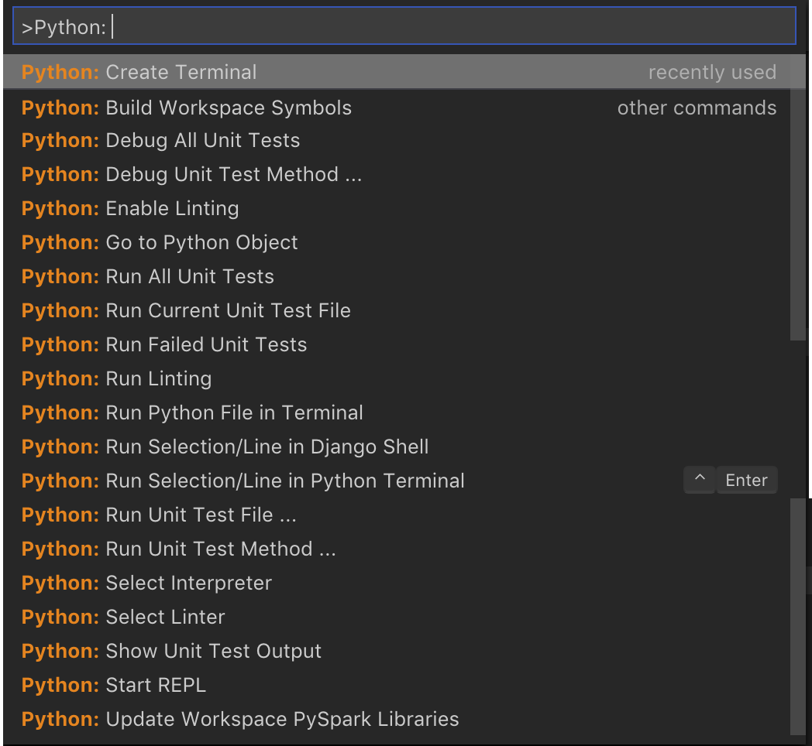
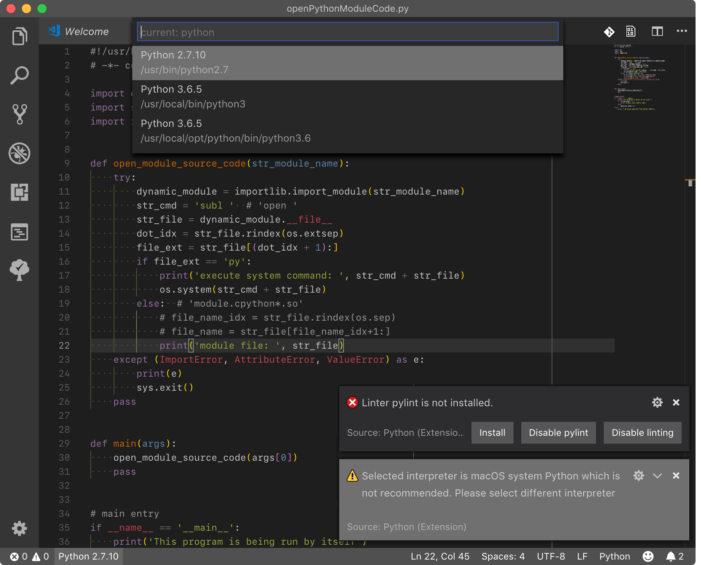
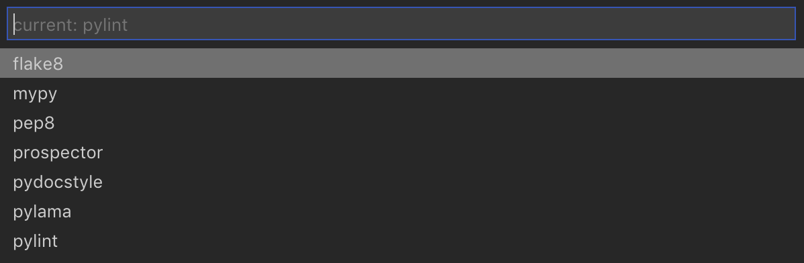
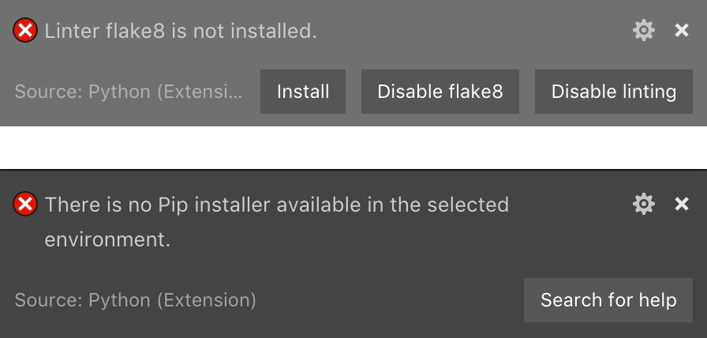
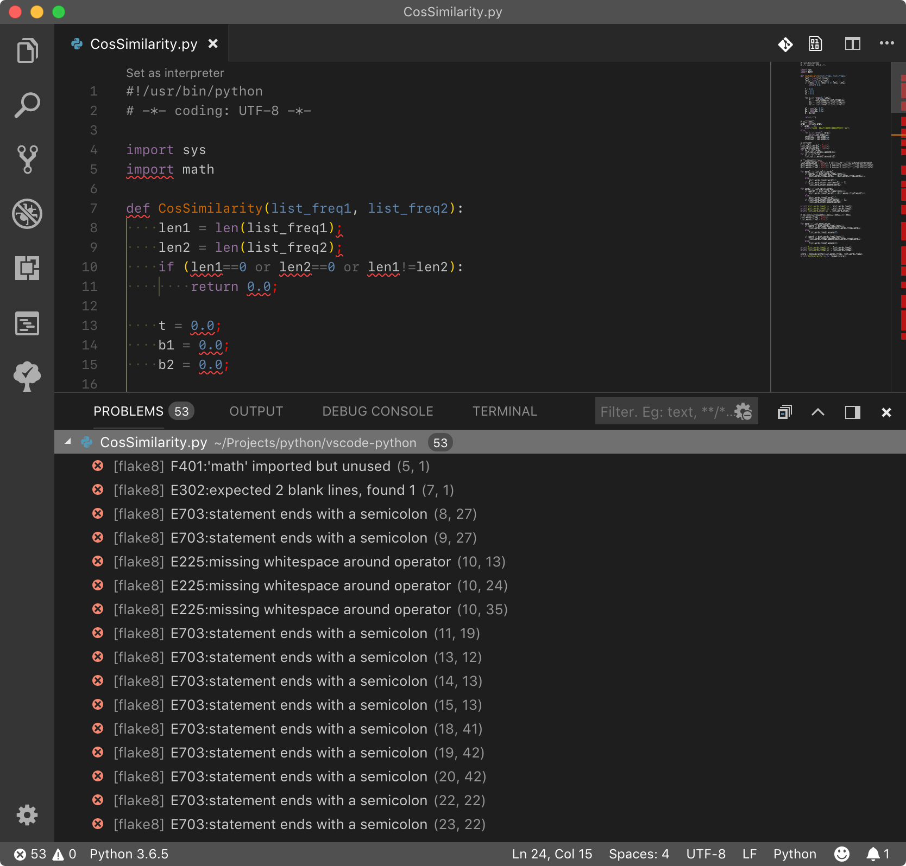

[TOC]

<!-- TOC -->

---

[Python in Visual Studio Code](https://code.visualstudio.com/docs/languages/python)

[Getting Started with Python](https://code.visualstudio.com/docs/python/python-tutorial)

* [Editing Code](https://code.visualstudio.com/docs/python/editing)  
* [Linting](https://code.visualstudio.com/docs/python/linting)  
* [Debugging](https://code.visualstudio.com/docs/python/debugging)  

# [Python extension for Visual Studio Code](https://marketplace.visualstudio.com/items?itemName=ms-python.python)

Linting, Debugging (multi-threaded, remote), Intellisense, code formatting, refactoring, unit tests, snippets, and more.

在 Command Palette 中输入 `Python: ` 可查看相关命令：



## interpreter

安装官方 ms-python.python 插件后，打开 `*.py` 文件，默认选择的是 macOS 自带的较老版本的 python 2.7 解释器，建议选择其他更新的解释器。

在 Command Palette 中输入 `Python: Select Interpreter` 或点击 EXPLORER 底下的 `Python 2.7.10`，将弹出可选的 Python 版本：



选择 Python 3.6.5 后，其路径将会配置到 User Settings 的 `python.pythonPath` 键下，覆写默认的 python。

```json
    // Path to Python, you can use a custom version of Python by modifying this setting to include the full path.
    "python.pythonPath": "/usr/local/bin/python3",
```

## [linter](https://code.visualstudio.com/docs/python/linting)

在 Command Palette 中输入 `Python: Select Linter` 将弹出可选的 Python Linter：



默认配置（Default User Settings）中开启了 pylint: 

```json
  // Whether to lint Python files.
  // Python: Enable Linting
  "python.linting.enabled": true,
  
  // Whether to lint Python files using pylint.
  "python.linting.pylintEnabled": true,
  
  // Whether to lint Python files using flake8
  "python.linting.flake8Enabled": false,

  // Whether to lint Python files when saved.
  "python.linting.lintOnSave": true,

  // Whether to lint Python files using pep8
  "python.linting.pep8Enabled": false,
```

但是本地 pip(3) 并未安装 pylint，所以底部弹出提示 `Linter pylint is not installed.`

建议采用 [flake8](http://flake8.readthedocs.org/en/latest/) 插件（基于 pycodestyle,pyflakes,mccabe）来作为 Python Linter。

终端执行 `pip3 list` 查看是否已安装了 **flake8**，如果未安装 flake8，可先执行 `pip3 install flake8` 安装。

修改 User Settings 禁用 pyling，启用 flake8: 

```json
  // Whether to lint Python files using pylint.
  "python.linting.pylintEnabled": false,
  
  // Whether to lint Python files using flake8
  "python.linting.flake8Enabled": true,
```

在选用 python 2.7 旧版本作为默认解释器时，仍提示 flake8 未安装，点击安装提示找不到 pip 安装器：



选用 python 3 新版解释器时，打开 python 文件，将自动调用 flake8 执行静态语法检查（Run Linting）。

控制台 OUTPUT - python 中输出相应的 Linting Output - flake8 检测结果：


控制台 PROBLEMS 中也会列出 flake8 检测结果：



## Workspace Symbols

按照 [ms-python.python](https://marketplace.visualstudio.com/items?itemName=ms-python.python) 文档 Optional Step 6：

> Install `ctags` for Workspace Symbols, from [here](http://ctags.sourceforge.net/), or using `brew install ctags` on macOS.

macOS/Xcode 工具链默认已经安装了 ctags，故不必重复安装：

```shell
faner@MBP-FAN:~|⇒  which ctags
/usr/bin/ctags
faner@MBP-FAN:~|⇒  whereis ctags
/usr/bin/ctags
faner@MBP-FAN:~|⇒  ctags -h
/Applications/Xcode.app/Contents/Developer/Toolchains/XcodeDefault.xctoolchain/usr/bin/ctags: illegal option -- h
usage: ctags [-BFadtuwvx] [-f tagsfile] file ...
```

但是由于自带的 ctags 太陈旧，可能导致无法使用，例如执行 `Python: Build Workspace Symbols` 失败：

```shell
----------Generating Tags----------
ctags --options=/Users/faner/.vscode/extensions/ms-python.python-2018.4.0/resources/ctagOptions --languages=Python --exclude=**/site-packages/** -o /Users/faner/Projects/ProjectRootDirectory/.vscode/tags .
/Applications/Xcode.app/Contents/Developer/Toolchains/XcodeDefault.xctoolchain/usr/bin/ctags: illegal option -- -
usage: ctags [-BFadtuwvx] [-f tagsfile] file ...
```

参考以下教程，通过 `brew install ctags` 安装最新的 ctags 替换系统默认的版本：

> [ctags.setup](https://gist.github.com/nazgob/1570678)  
> [Python ctags subprocess call in Mac OSX](https://stackoverflow.com/questions/20644939/python-ctags-subprocess-call-in-mac-osx)  

## [formatting](https://donjayamanne.github.io/pythonVSCodeDocs/docs/formatting/)

The Python extension supports source code formatting using either [autopep8](https://pypi.org/project/autopep8/) (the default) or [yapf](https://pypi.org/project/yapf/).

### [autopep8](https://github.com/hhatto/autopep8)

首先需要执行以下命令安装 autopep8：

```shell
$ pip3 install pep8   
$ pip3 install --upgrade autopep8
```

vscode 默认使用 autopep8 作为格式化工具：

```json
  // Provider for formatting. Possible options include 'autopep8' and 'yapf'.
  "python.formatting.provider": "autopep8"
```

使用快捷键 <kbd>⌥</kbd><kbd>⇧</kbd><kbd>F</kbd> 即可调用 autopepe8 格式化 python 代码（format document）。

### [yapf](https://github.com/google/yapf)

首先需要执行以下命令安装 yapf：

```shell
$ pip3 install yapf
```

修改 vscode 的 User Settings：

```json
  // Provider for formatting. Possible options include 'autopep8' and 'yapf'.
  "python.formatting.provider": "yapf"
```

使用快捷键 <kbd>⌥</kbd><kbd>⇧</kbd><kbd>F</kbd> 即可调用 yapf 格式化 python 代码（format document）。
