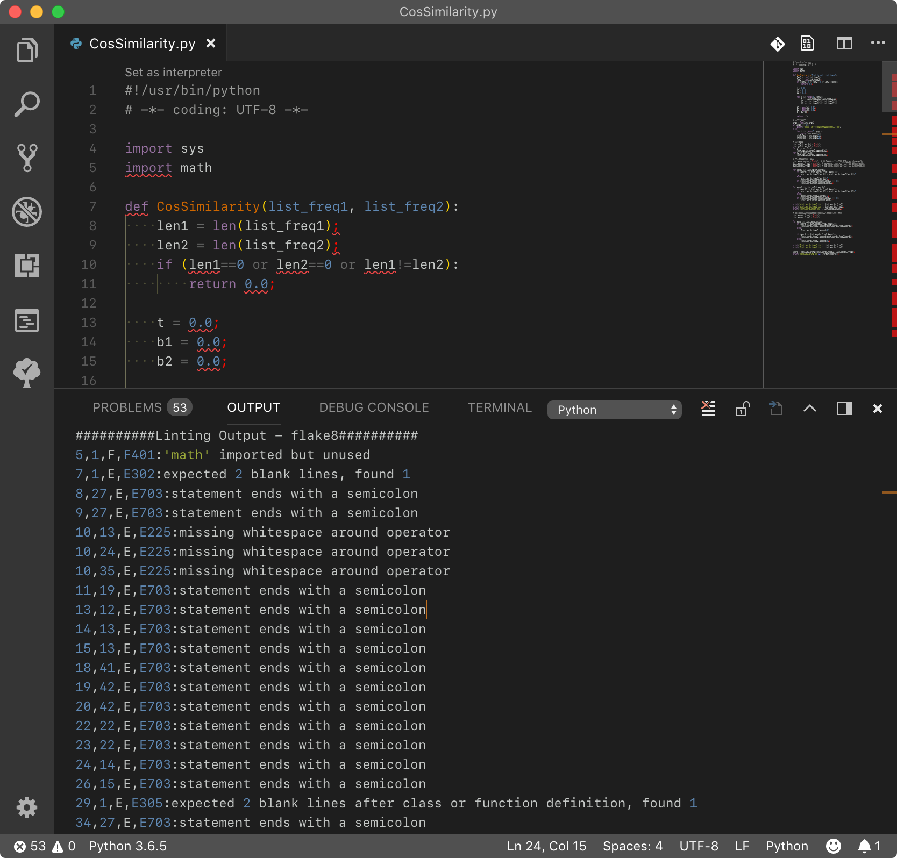

[TOC]

<!-- TOC -->

---

[Python in Visual Studio Code](https://code.visualstudio.com/docs/languages/python)

[Getting Started with Python](https://code.visualstudio.com/docs/python/python-tutorial)

* [Editing Code](https://code.visualstudio.com/docs/python/editing)  
* [Linting](https://code.visualstudio.com/docs/python/linting)  
* [Debugging](https://code.visualstudio.com/docs/python/debugging)  

# [Python extension for Visual Studio Code](https://marketplace.visualstudio.com/items?itemName=ms-python.python)

Linting, Debugging (multi-threaded, remote), Intellisense, code formatting, refactoring, unit tests, snippets, and more.

在 Command Palette 中输入 `Python: ` 可查看相关命令：


## interpreter

安装官方 ms-python.python 插件后，打开 `*.py` 文件，默认选择的是 macOS 自带的较老版本的 python 2.7 解释器，建议选择其他更新的解释器。

在 Command Palette 中输入 `Python: Select Interpreter` 或点击 EXPLORER 底下的 `Python 2.7.10`，将弹出可选的 Python 版本：


选择 Python 3.6.5 后，其路径将会配置到 User Settings 的 `python.pythonPath` 键下，覆写默认的 python。

```json
    // Path to Python, you can use a custom version of Python by modifying this setting to include the full path.
    "python.pythonPath": "/usr/local/bin/python3",
```

## [linter](https://code.visualstudio.com/docs/python/linting)

在 Command Palette 中输入 `Python: Select Linter` 将弹出可选的 Python Linter：


默认配置（Default User Settings）中开启了 python.linting 和保存时 lint 检测: 

```json
  // Whether to lint Python files.
  // Python: Enable Linting
  "python.linting.enabled": true,

  // Whether to lint Python files using flake8
  "python.linting.flake8Enabled": false,

  // Whether to lint Python files using mypy.
  "python.linting.mypyEnabled": false,

  // Whether to lint Python files using prospector.
  "python.linting.prospectorEnabled": false,

  // Whether to lint Python files using pycodestyle
  "python.linting.pycodestyleEnabled": false,

  // Whether to lint Python files using pydocstyle
  "python.linting.pydocstyleEnabled": false,

  // Whether to lint Python files using pylama.
  "python.linting.pylamaEnabled": false,

  // Whether to lint Python files using pylint.
  "python.linting.pylintEnabled": false,

  // Whether to lint Python files when saved.
  "python.linting.lintOnSave": true,
```

但是本地 pip(3) 并未安装 pylint，所以底部弹出提示 `Linter pylint is not installed.`

建议采用 [flake8](http://flake8.readthedocs.org/en/latest/) 插件（基于 pycodestyle,pyflakes,mccabe）来作为 Python Linter。

终端执行 `pip3 list` 查看是否已安装了 **flake8**，如果未安装 flake8，可先执行 `pip3 install flake8` 安装。

修改 User Settings 禁用 pylint，启用 flake8：

```json
  // Whether to lint Python files using pylint.
  "python.linting.pylintEnabled": false,
  // Whether to lint Python files using flake8
  "python.linting.flake8Enabled": true,
```

在选用 python 2.7 旧版本作为默认解释器时，仍提示 flake8 未安装，点击安装提示找不到 pip 安装器：


选用 python 3 新版解释器时，打开 python 文件，将自动调用 flake8 执行静态语法检查（Run Linting）。

控制台 OUTPUT - python 中输出相应的 Linting Output - flake8 检测结果：



控制台 PROBLEMS 中也会列出 flake8 检测结果：


### 2023最新配置flake8

08Nov23最新的vscode Version: 1.84.1，配置中不再有 `python.linting` 等选项。

参考 [Linting Python in Visual Studio Code](https://code.visualstudio.com/docs/python/linting)：

> Linting is distinct from Formatting because linting analyzes how the code runs and detects errors whereas formatting only restructures how code appears.

安装 [Flake8](https://marketplace.visualstudio.com/items?itemName=ms-python.flake8) 插件后，默认自动开启 Flake8 作为 python linter。

> Once installed in Visual Studio Code, flake8 will be automatically executed when you open a Python file.

如果不安装 Flake8，则默认走Pylance的静态语法检查机制。

**思考**：

1. 如何配置 `flake8.path` 指定 conda 中 pip 安装的 flake8？
2. 如何配置 `flake8.ignorePatterns` 设置 MaxLineLength 为 120，忽略 E501 错误提示？

[python flake8 ignore E501 and max-line-length](https://stackoverflow.com/questions/64435962/python-flake8-ignore-e501-and-max-line-length)

### MaxLineLength

[How to tell flake8 to ignore comments](https://stackoverflow.com/questions/47876079/how-to-tell-flake8-to-ignore-comments)

create a configuration file named `.flake8` in project directory:

```
[flake8]
per-file-ignores =
    # line too long
    path/to/file.py: E501,
```

[vscode 编写python如何禁止 flake8 提示 line too long](https://www.cnblogs.com/tangxin-blog/p/6065017.html)
[修改在 Visual Studio Code 中 autopep8 的單行長度設定](https://exfast.me/2020/04/python-modify-the-single-line-length-setting-of-autopep8-in-visual-studio-code/)

```
    "python.linting.flake8Args": ["--max-line-length=120"],
```

## Workspace Symbols

按照 [ms-python.python](https://marketplace.visualstudio.com/items?itemName=ms-python.python) 文档 Optional Step 6：

> Install `ctags` for Workspace Symbols, from [here](http://ctags.sourceforge.net/), or using `brew install ctags` on macOS.

macOS/Xcode 工具链默认已经安装了 ctags，故不必重复安装：

```shell
faner@MBP-FAN:~|⇒  which ctags
/usr/bin/ctags
faner@MBP-FAN:~|⇒  whereis ctags
/usr/bin/ctags
faner@MBP-FAN:~|⇒  ctags -h
/Applications/Xcode.app/Contents/Developer/Toolchains/XcodeDefault.xctoolchain/usr/bin/ctags: illegal option -- h
usage: ctags [-BFadtuwvx] [-f tagsfile] file ...
```

但是由于自带的 ctags 太陈旧，可能导致无法使用，例如执行 `Python: Build Workspace Symbols` 失败：

```shell
----------Generating Tags----------
ctags --options=/Users/faner/.vscode/extensions/ms-python.python-2018.4.0/resources/ctagOptions --languages=Python --exclude=**/site-packages/** -o /Users/faner/Projects/ProjectRootDirectory/.vscode/tags .
/Applications/Xcode.app/Contents/Developer/Toolchains/XcodeDefault.xctoolchain/usr/bin/ctags: illegal option -- -
usage: ctags [-BFadtuwvx] [-f tagsfile] file ...
```

参考以下教程，通过 `brew install ctags` 安装最新的 ctags 替换系统默认的版本：

> [ctags.setup](https://gist.github.com/nazgob/1570678)  
> [Python ctags subprocess call in Mac OSX](https://stackoverflow.com/questions/20644939/python-ctags-subprocess-call-in-mac-osx)  

## [formatting](https://donjayamanne.github.io/pythonVSCodeDocs/docs/formatting/)

The Python extension supports source code formatting using either [autopep8](https://pypi.org/project/autopep8/) (the default) or [yapf](https://pypi.org/project/yapf/).

### [autopep8](https://github.com/hhatto/autopep8)

首先需要执行以下命令安装 autopep8：

```shell
$ pip3 install pep8   
$ pip3 install --upgrade autopep8
```

vscode 默认使用 autopep8 作为格式化工具：

```json
  // Provider for formatting. Possible options include 'autopep8' and 'yapf'.
  "python.formatting.provider": "autopep8"
```

使用快捷键 <kbd>⌥</kbd><kbd>⇧</kbd><kbd>F</kbd> 即可调用 autopepe8 格式化 python 代码（format document）。

### 2023最新配置autopep8

08Nov23最新的vscode Version: 1.84.1，配置中不再有 `python.formatting.provider` 选项。

参考 [Formatting Python in VS Code](https://code.visualstudio.com/docs/python/formatting)：

> Keep in mind, formatting doesn't affect the functionality of the code itself.
> Linting helps to prevent errors by analyzing code for common syntactical, stylistic, and functional errors and unconventional programming practices.
> Although there is a little overlap between formatting and linting, the two capabilities are complementary.

安装插件 [autopep8](https://marketplace.visualstudio.com/items?itemName=ms-python.autopep8) 后，修改 User Settings 启用指定 editor 编辑 python 语言时，使用格式化器 autopep8：

```json
    "[python]": {
      "editor.defaultFormatter": "ms-python.autopep8",
      // "editor.formatOnSave": true // 保存时，自动格式化
    }
```

### [yapf](https://github.com/google/yapf)

首先需要执行以下命令安装 yapf：

```shell
$ pip3 install yapf
```

修改 vscode 的 User Settings：

```json
  // Provider for formatting. Possible options include 'autopep8' and 'yapf'.
  "python.formatting.provider": "yapf"
```

使用快捷键 <kbd>⌥</kbd><kbd>⇧</kbd><kbd>F</kbd> 即可调用 yapf 格式化 python 代码（format document）。

### MaxLineLength

[2020年，PEP8指定一行最大长度79的标准是否值得坚持？](https://www.dongwm.com/post/pep8-max-line-length/)

[PEP 8 -- Style Guide for Python Code](https://www.python.org/dev/peps/pep-0008/) - [Maximum Line Length](https://www.python.org/dev/peps/pep-0008/#maximum-line-length)  

Limit all lines to a maximum of 79 characters.

For flowing long blocks of text with fewer structural restrictions (docstrings or comments), the line length should be limited to 72 characters.

Limiting the required editor window width makes it possible to have several files open side by side, and works well when using code review tools that present the two versions in adjacent columns.

The default wrapping in most tools disrupts the visual structure of the code, making it more difficult to understand. The limits are chosen to avoid wrapping in editors with the window width set to 80.

[Disable auto wrap long line in Visual Studio Code](https://stackoverflow.com/questions/47406741/disable-auto-wrap-long-line-in-visual-studio-code)

autopep8Args 配置一行显示列数：

```json
    "python.formatting.provider": "autopep8"
    // "python.formatting.autopep8Args": ["--max-line-length=120"],
    "python.formatting.autopep8Args": [
        "--max-line-length", "120", "--experimental"
    ],
```

yapfArgs 对应配置：

```json
    "python.formatting.yapfArgs": [
        "--style", "{based_on_style: chromium, indent_width: 20}"
    ],
```

pylintArgs 对应配置：

Autopep8 requires `--aggressive` in order to recommend non-whitespace changes:

```
    "python.linting.pylintArgs": ["--max-line-length", "120", "--aggressive"]
```

This will wrap the long lines for you. —— 未实践验证
